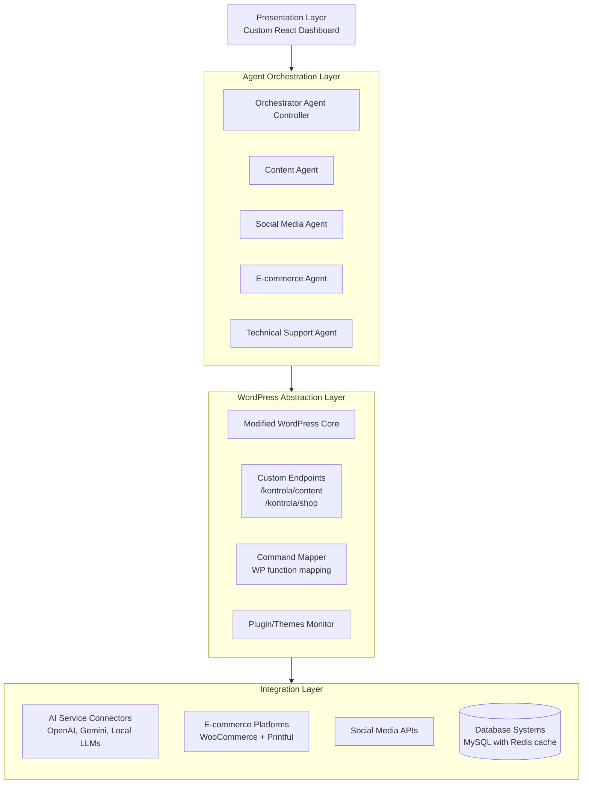
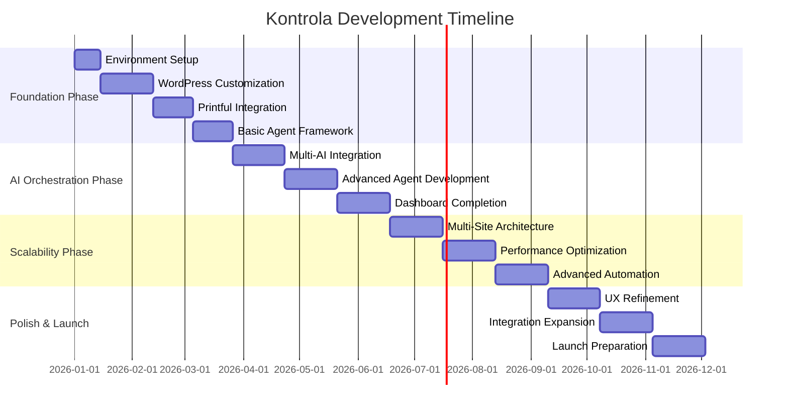
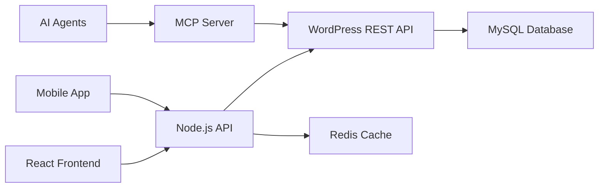

Analyze this codebase to generate or update .github/copilot-instructions.md for guiding AI coding agents.

Focus on discovering the essential knowledge that would help an AI agents be immediately productive in this codebase. Consider aspects like:

The "big picture" architecture that requires reading multiple files to understand - major components, service boundaries, data flows, and the "why" behind structural decisions
Critical developer workflows (builds, tests, debugging) especially commands that aren't obvious from file inspection alone
Project-specific conventions and patterns that differ from common practices
Integration points, external dependencies, and cross-component communication patterns
Source existing AI conventions from **/{.github/copilot-instructions.md,AGENT.md,AGENTS.md,CLAUDE.md,.cursorrules,.windsurfrules,.clinerules,.cursor/rules/**,.windsurf/rules/**,.clinerules/**,README.md,Kontrola-blueprint.md} (do one glob search).

Guidelines (read more at https://aka.ms/vscode-instructions-docs):

If .github/copilot-instructions.md exists, merge intelligently - preserve valuable content while updating outdated sections
Write concise, actionable instructions using markdown structure
Include specific examples from the codebase when describing patterns
Avoid generic advice ("write tests", "handle errors") - focus on THIS project's specific approaches
Document only discoverable patterns, not aspirational practices
Reference key files/directories that exemplify important patterns
Update .github/copilot-instructions.md for the user, then ask for feedback on any unclear or incomplete sections to iterate including writing a new readme.md file that reflects our projects and goals. then proceed to create  the "Kontrola" AI marketing platform. 

- **Project Overview**: Introduction to Kontrola as a fully automated AI marketing SaaS platform built on WordPress.
- **Technical Architecture**: Detailed layered architecture diagram and core system components.
- **Core Components**: In-depth analysis of Agent Orchestration, WordPress Core, and integration systems.
- **Development Roadmap**: Four-phase implementation plan with timelines and resource requirements.

-------

# Kontrola AI Marketing Platform: Complete Technical Design & Implementation Document  

## 1 Project Overview & Vision Statement  

Kontrola represents a **paradigm shift in automated marketing systems** - a fully autonomous AI-driven platform built on WordPress that transforms how businesses manage their entire digital presence. Unlike traditional marketing tools that require manual intervention, Kontrola functions as a **self-orchestrating ecosystem** where AI agents control content creation, e-commerce operations, social media management, customer support, and technical maintenance. The platform's core innovation lies in its ability to make WordPress entirely transparent to end-users while leveraging its mature ecosystem as a robust backend foundation.  

The strategic vision positions Kontrola as the **first truly autonomous marketing operating system**, capable of handling the complete 360-degree marketing lifecycle for businesses of all sizes. By abstracting WordPress's complexity through a sophisticated agent framework and custom interface, we enable users to focus on strategy while the AI handles execution across content generation (using platforms like OpenAI and Google Gemini), WooCommerce management with Printful integration, social media automation, SEO optimization, and customer relationship management. The platform's extensible architecture supports multiple AI endpoints including local solutions (LM Studio, Ollama) and cloud services, creating a **vendor-agnostic AI orchestration layer** that can adapt to evolving AI technologies.  

## 2 Technical Architecture Design  

### 2.1 Layered Architecture Overview  
Kontrola employs a **five-layer architectural model** that separates concerns while enabling tight integration between AI orchestration and WordPress operations:  

- **Presentation Layer**: Custom React/Vue.js dashboard that completely obscures WordPress admin interfaces while providing real-time analytics, chat-based agent interaction ("vibing"), and visual task management. This layer implements the "opaque WordPress" principle by routing all requests through custom endpoints rather than traditional wp-admin paths.  
- **Agent Orchestration Layer**: Core AI intelligence system built using OpenAI's Agents SDK or similar frameworks, featuring specialized agents for content generation, social media management, e-commerce operations, and technical maintenance. This layer includes a **context-aware command mapper** that translates natural language requests into executable WordPress functions.  
- **WordPress Abstraction Layer**: Modified WordPress core with custom routing (replacing wp-content, wp-admin with branded paths), extended REST API/GraphQL endpoints, and plugin/theme detection systems that expose functionality to agents.  
- **Integration Layer**: Connectors for AI services (OpenAI, Gemini, local LLMs), e-commerce platforms (WooCommerce with Printful), social media APIs, and external analytics services.  
- **Infrastructure Layer**: Optimized LEMP stack (Linux, Nginx, MySQL/MariaDB, PHP 8+) with Redis caching, Docker containerization, and automated scaling capabilities.  

### 2.2 Core System Architecture Diagram  



*Figure 1: Kontrola's five-layer architectural model showing data flow and component relationships*

### 2.3 Multi-Site vs Single-Site Architecture Decision  
Based on comprehensive analysis of WordPress multisite versus single-site architectures, Kontrola implements a **hybrid deployment model** that offers both options during onboarding:  

- **Single-Site Architecture**: Recommended for most users, providing isolated resources, simpler backup/restore procedures, full plugin compatibility, and dedicated performance characteristics. Each installation maintains separate databases and file structures, preventing "noisy neighbor" issues where one site's traffic spikes affect others.  
- **Multi-Site Architecture**: Available for enterprise clients or agencies managing multiple related brands, offering centralized user management, shared plugin/theme installation, and unified updates. Our implementation includes enhanced isolation features to mitigate multisite risks like shared failure points and complex migrations.  

The architecture decision during onboarding affects database structure (shared tables with site prefixes for multisite vs independent tables for single-site), user role hierarchy (with super-admin capabilities for multisite), and resource allocation strategies. Both configurations maintain identical agent capabilities and user experiences through our abstraction layer.  

## 3 Core System Components  

### 3.1 Agent Orchestration System  
The heart of Kontrola is its **modular agent framework** capable of handling diverse marketing and operational tasks:  

- **Orchestrator Agent**: Central controller that manages task distribution, inter-agent communication, and priority queuing. Maintains comprehensive context including WordPress configuration state, active plugins/themes, server health metrics, and ongoing operations. Implements **load balancing across AI endpoints** for different task types (text generation, image creation, video production, speech synthesis/recognition).  
- **Content Generation Agent**: Specializes in creating and optimizing website content using WordPress's editorial workflow. Integrates with Advanced Custom Fields and WPGraphQL for structured content management, automatically generating blog posts, product descriptions, landing pages, and email campaigns while maintaining brand voice consistency.  
- **E-commerce Management Agent**: Manages WooCommerce operations including Printful integration for print-on-demand merchandise. Handles product creation/updating, inventory synchronization, order processing, shipping configuration, and automated customer notifications. Implements Printful's API connection process including permalink configuration, legacy API enabling, and product synchronization.  
- **Social Media Agent**: Creates, schedules, and publishes content across configured social platforms. Includes performance analytics tracking and adaptive posting strategies based on engagement metrics.  
- **Technical Maintenance Agent**: Monitors WordPress core, plugin, and theme updates; performs security audits; optimizes database performance; and manages backups. Has **controlled access** to wp-config.php and server filesystem based on security policies set in the dashboard.  

Each agent implements **tool-use functionality** that dynamically adapts based on installed WordPress plugins and themes, automatically discovering available actions through WordPress's hook system and REST API endpoints.  

### 3.2 WordPress Customization & Abstraction  

To achieve the "opaque WordPress" experience, we implement extensive modifications to standard WordPress installations:  

- **Path Rewriting & Obfuscation**: Complete URL restructuring replacing wp-admin, wp-content, and wp-includes with custom paths (/kontrola/console, /kontrola/assets, /kontrola/core). Implemented via .htaccess/nginx rewrite rules combined with WordPress filter hooks and custom mu-plugins.  
- **Custom Dashboard Development**: Replacement of WordPress admin with Kontrola's React-based interface featuring:  
  - Real-time analytics dashboard with graphs, meters, and performance charts  
  - Natural language chat interface for "vibing" with agents  
  - Visual task management system (current, queued, completed, failed tasks)  
  - AI endpoint configuration panel supporting multiple service providers  
- **Extended API Layer**: Enhanced REST API and GraphQL endpoints exposing all WordPress functionality in agent-consumable formats. Integration with WPGraphQL provides efficient data querying for complex agent operations.  
- **Plugin/Theme Detection Engine**: Automated scanning and capability mapping system that informs agents of available functionality. When new plugins are installed, the system automatically generates appropriate tool definitions for agent use.  

### 3.3 Integration Systems  

Kontrola's power derives from its extensive integration capabilities across multiple service categories:  

- **AI Service Integration Framework**: Unified interface supporting multiple AI providers with fallback mechanisms. Configuration includes:  
  - **Text Generation**: OpenAI GPT models, Google Gemini, Anthropic Claude, local LLMs (via LM Studio, Ollama, vLLM)  
  - **Image Generation**: DALL-E, Midjourney API, Stable Diffusion (via ComfyUI)  
  - **Video/Audio**: Runway ML, Google Veo, ElevenLabs for voice synthesis  
  - **Load Balancing Logic**: Intelligent routing based on cost, latency, and capability requirements  
- **E-commerce Integration**: WooCommerce foundation with specialized Printful integration for print-on-demand. The implementation follows Printful's documented connection process:  
  1. WordPress permalink configuration (non-plain structure)  
  2. WooCommerce Legacy REST API enabling  
  3. Printful plugin installation and store connection  
  4. Automated product catalog synchronization  
  5. Shipping and tax configuration management  
- **Social Media Integration**: API connectors for Facebook/Instagram, Twitter/X, LinkedIn, Pinterest, and TikTok with unified content adaptation and publishing workflow.  
- **Analytics & Monitoring**: Google Analytics, Facebook Pixel, custom event tracking, and server health monitoring integration.  

## 4 Development Roadmap & Implementation Phases  

### 4.1 Phase 1: Foundation & Core Integration (Months 1-3)  

**Objectives**: Establish basic WordPress foundation with initial AI integration and Printful e-commerce setup.  

- **Week 1-2**: Environment Setup & Architecture Finalization  
  - Docker-based development environment with WordPress 6.5+  
  - LEMP stack optimization for high-performance WordPress  
  - Git repository structure and CI/CD pipeline configuration  
- **Week 3-6**: WordPress Core Customization  
  - Path rewriting implementation (/wp-admin/ → /kontrola/console/)  
  - Custom dashboard skeleton development  
  - Basic user onboarding workflow (brand info, social media, billing)  
- **Week 7-9**: Printful + WooCommerce Integration  
  - Automated Printful plugin installation and configuration  
  - Product import/export synchronization system  
  - Order processing automation foundation  
- **Week 10-12**: Basic Agent Framework  
  - Orchestrator agent with simple task queue  
  - Content generation agent using OpenAI API  
  - Initial command mapping to WordPress functions  

### 4.2 Phase 2: AI Orchestration & Advanced Features (Months 4-6)  

**Objectives**: Develop comprehensive agent system with multi-endpoint AI support and advanced automation.  

- **Month 4**: Multi-AI Endpoint Integration  
  - Support for Google Gemini, Anthropic Claude, local LLMs  
  - Load balancing and fallback mechanisms  
  - Unified configuration interface for API keys and endpoints  
- **Month 5**: Advanced Agent Capabilities  
  - Social media management agent with scheduling  
  - Technical maintenance agent with update management  
  - E-commerce agent with inventory and order automation  
- **Month 6**: Enhanced User Experience  
  - Complete custom dashboard with analytics  
  - Natural language chat interface  
  - Task management visualization system  

### 4.3 Phase 3: Multi-Site & Scalability (Months 7-9)  

**Objectives**: Implement multi-site capabilities and optimize for enterprise-scale deployment.  

- **Month 7**: Multi-Site Architecture  
  - Network administration interface  
  - Resource isolation and performance optimization  
  - Cross-site user management system  
- **Month 8**: Performance & Security Optimization  
  - Redis/Memcached integration for object caching  
  - Security hardening and agent permission system  
  - Automated backup and disaster recovery  
- **Month 9**: Advanced Automation Features  
  - Predictive content generation based on analytics  
  - Automated A/B testing and optimization  
  - Customer support agent with FAQ generation  

### 4.4 Phase 4: Polish & Expansion (Months 10-12)  

**Objectives**: Refine user experience, add advanced features, and prepare for launch.  

- **Month 10**: User Experience Refinement  
  - Onboarding optimization based on beta feedback  
  - Mobile-responsive dashboard improvements  
  - Documentation and help system completion  
- **Month 11**: Advanced Integration Expansion  
  - Additional e-commerce platform support  
  - Extended social media platform integration  
  - CRM and email marketing platform connectors  
- **Month 12**: Launch Preparation  
  - Load testing and performance optimization  
  - Security audit and compliance verification  
  - Marketing website and documentation finalization  

## 5 Technical Specifications & Requirements  

### 5.1 Server Infrastructure Requirements  

- **Hosting Environment**: Minimum VPS with 4 CPU cores, 8GB RAM, 100GB SSD storage  
- **Software Stack**:  
  - Linux (Ubuntu 22.04 LTS or later)  
  - Nginx 1.24+ with FastCGI caching  
  - PHP 8.2+ with OPcache enabled  
  - MariaDB 10.11+ or MySQL 8.0+  
  - Redis 7.0+ for object caching  
- **WordPress Configuration**:  
  - WordPress 6.5+ (multisite capable)  
  - Custom memory limits (WP_MEMORY_LIMIT = 256M)  
  - Enhanced security salts and keys  
  - Disabled file editing via wp-config.php  

### 5.2 Security Implementation  

- **Agent Permission System**: Granular control over filesystem access, database operations, and WordPress configuration modifications. Implements whitelist-based approach where agents only access explicitly permitted resources.  
- **API Security**: OAuth 2.0 implementation for external API connections, encrypted API key storage, and IP-based access restrictions for critical operations.  
- **WordPress Hardening**: Implementation of security best practices including:  
  - Two-factor authentication for all admin accounts  
  - Login attempt limiting and monitoring  
  - Regular security scanning and vulnerability assessment  
  - Automated backup with off-site storage  
- **Data Protection**: End-to-end encryption for sensitive customer data, GDPR/CCPA compliance features, and data anonymization for analytics.  

## 6 Team Structure & Resource Allocation  

### 6.1 Development Team Composition  

- **Project Lead/Architect** (1): Overall technical direction, architecture decisions, integration planning  
- **WordPress Specialists** (2): Core WordPress customization, plugin development, theme creation  
- **Frontend Developers** (2): React/Vue.js dashboard, user interface, real-time analytics visualization  
- **Backend/API Developers** (2): Agent framework, AI integration, performance optimization  
- **DevOps Engineer** (1): Server infrastructure, deployment automation, monitoring systems  
- **AI/ML Specialist** (1): Agent intelligence, prompt engineering, model optimization  
- **UI/UX Designer** (1): User experience design, onboarding flows, interface consistency  

### 6.2 Development Timeline & Milestones  



*Figure 2: Detailed 12-month development timeline with key milestones and dependencies*

## 7 Risk Assessment & Mitigation Strategies  

### 7.1 Technical Risks  

- **WordPress Core Update Compatibility**: Regular WordPress updates may break custom modifications.  
  *Mitigation*: Implementation of comprehensive test suite, version pinning with scheduled update reviews, and abstraction layer that minimizes direct core modifications.  
- **AI Service Reliability**: Dependency on external AI APIs creates potential single points of failure.  
  *Mitigation*: Multi-provider architecture with automatic failover, local LLM fallback options, and graceful degradation when services are unavailable.  
- **Performance Under Load**: Complex agent operations combined with WordPress may create performance bottlenecks.  
  *Mitigation*: Advanced caching strategy, database optimization, asynchronous task processing, and scalable infrastructure design.  

### 7.2 Business Risks  

- **Market Competition**: Existing marketing automation platforms may develop similar AI capabilities.  
  *Mitigation*: First-mover advantage, patent protection for novel agent interactions, and continuous innovation roadmap.  
- **User Adoption Complexity**: Businesses may struggle to trust fully automated marketing systems.  
  *Mitigation*: Gradual feature rollout, comprehensive training materials, and transparent "why" explanations for agent decisions.  

## 8 Success Metrics & Evaluation Criteria  

### 8.1 Technical Performance Metrics  

- **System Uptime**: 99.9% availability target with comprehensive monitoring  
- **Task Completion Rate**: >95% successful agent task execution without human intervention  
- **Response Time**: <2 second dashboard load time, <5 second agent response for simple tasks  
- **Integration Reliability**: >99% successful API calls to external services  

### 8.2 Business Impact Metrics  

- **User Productivity Improvement**: Target 70% reduction in time spent on marketing tasks  
- **Content Output Increase**: Minimum 5x increase in content production capacity  
- **ROI Measurement**: Average 3-month return on investment for customers  
- **Customer Satisfaction**: Net Promoter Score >50 within first year  

## 9 Conclusion & Next Steps  

Kontrola represents an ambitious but achievable vision for the future of automated marketing. By leveraging WordPress's mature ecosystem while completely reimagining its interface through AI agent orchestration, we create a platform that delivers unprecedented automation capabilities while maintaining accessibility for businesses of all sizes.  

**Immediate Next Steps**:  
1. **Assemble Core Development Team** with expertise in WordPress, React, and AI integration  
2. **Establish Development Environment** with Docker-based WordPress multisite configuration  
3. **Create Detailed API Specifications** for agent-WordPress communication layer  
4. **Develop Prototype Agent Framework** with basic content generation capabilities  
5. **Implement Printful Integration** following documented connection process  

this framework for development roadmap provides a realistic path to minimum viable product within 6 months and full feature release less than a month. With proper resource allocation and adherence to the architectural principles outlined in this document, Kontrola should successfully launch as the market's first fully autonomous AI sales commerce and marketing platform.

============================================================================================================================================================================================================================================================
============================================================================================================================================================================================================================================================
============================================================================================================================================================================================================================================================
============================================================================================================================================================================================================================================================
============================================================================================================================================================================================================================================================
============================================================================================================================================================================================================================================================

# Kontrola: Technical Architecture & WordPress Integration Framework

## 1. AI Developer Onboarding: Mastering WordPress Internals

### 1.1 Core WordPress Control Points for AI Integration

**Immediate Familiarization Targets for AI Development Team:**

```php
// 1. WORDPRESS HOOKS SYSTEM - Primary control mechanism
add_action('init', 'kontrola_early_control'); // Earliest possible control point
add_action('plugins_loaded', 'kontrola_plugin_control'); // After plugins load
add_filter('all', 'kontrola_monitor_all_hooks'); // Monitor ALL WordPress hooks

// 2. CRITICAL CONTROL FILES - Require full access
$wp_critical_paths = [
    'ABSPATH . WPINC . '/class-wp.php', // Main WordPress class
    'ABSPATH . WPINC . '/plugin.php', // Plugin API
    'ABSPATH . WPINC . '/http.php', // HTTP requests
    'ABSPATH . WPINC . '/cron.php', // Scheduled tasks
    'ABSPATH . 'wp-config.php', // Configuration
    'WP_CONTENT_DIR . '/mu-plugins/kontrola-core.php', // Must-use plugin
];

// 3. DATABASE ABSTRACTION LAYER
class Kontrola_WP_DB extends wpdb {
    public function __construct($dbuser, $dbpassword, $dbname, $dbhost) {
        parent::__construct($dbuser, $dbpassword, $dbname, $dbhost);
        $this->add_filter_hooks();
    }
    
    private function add_filter_hooks() {
        add_filter('query', [$this, 'monitor_all_queries']);
        add_filter('pre_query', [$this, 'intercept_queries']);
    }
}
```

**Essential WordPress Core Functions to Master:**

```php
// 1. POST/PAGE MANAGEMENT (Avoid recreating WordPress functionality)
// USE: wp_insert_post(), wp_update_post(), wp_delete_post()
function kontrola_create_post_via_native($agent_instructions) {
    // Instead of raw SQL, use WordPress API
    $post_id = wp_insert_post([
        'post_title'    => wp_strip_all_tags($agent_instructions['title']),
        'post_content'  => $agent_instructions['content'],
        'post_status'   => 'publish',
        'post_author'   => get_user_by('email', 'ai@kontrola.local')->ID,
        'post_type'     => 'post',
        'meta_input'    => [
            '_kontrola_ai_generated' => true,
            '_kontrola_agent_id'     => $agent_instructions['agent_id']
        ]
    ]);
    
    // Use native taxonomy functions
    wp_set_post_terms($post_id, $agent_instructions['categories'], 'category');
    wp_set_post_terms($post_id, $agent_instructions['tags'], 'post_tag');
    
    return $post_id; // WordPress handles revision, caching, hooks
}

// 2. USER MANAGEMENT - Use existing WordPress functions
function kontrola_create_ai_user() {
    $user_id = wp_create_user(
        'kontrola_ai_agent',
        wp_generate_password(64, true, true),
        'ai-agent@kontrola.system'
    );
    
    // Grant capabilities via native role system
    $user = new WP_User($user_id);
    $user->add_cap('edit_posts');
    $user->add_cap('edit_pages');
    $user->add_cap('manage_options');
    $user->add_cap('ai_full_control'); // Custom capability
}
```

### 1.2 WordPress Update Strategy for Customized Core

**Git-Based Custom WordPress Management:**

```yaml
# .gitmodules - Managed WordPress core with customizations
[submodule "wordpress"]
    path = wordpress
    url = https://github.com/WordPress/WordPress.git
    branch = 6.5
    update = rebase

[submodule "kontrola-core-modifications"]
    path = wordpress-custom
    url = git@github.com:kontrola/wordpress-core-modifications.git
    branch = main

# composer.json - Managed dependencies
{
    "require": {
        "johnpbloch/wordpress-core": "6.5.*",
        "kontrola/wordpress-core-patches": "dev-main"
    },
    "repositories": [
        {
            "type": "vcs",
            "url": "git@github.com:kontrola/wordpress-core-patches.git",
            "no-api": true
        }
    ],
    "extra": {
        "wordpress-install-dir": "public/wp",
        "installer-paths": {
            "public/wp-content/plugins/{$name}/": ["type:wordpress-plugin"],
            "public/wp-content/mu-plugins/{$name}/": ["type:wordpress-muplugin"]
        },
        "patches": {
            "johnpbloch/wordpress-core": {
                "Custom admin paths": "patches/custom-admin-paths.patch",
                "Enhanced REST API": "patches/enhanced-rest-api.patch"
            }
        }
    }
}
```

**Automated Update Integration Script:**

```php
// kontrola-update-manager.php
class Kontrola_Update_Manager {
    private $github_token = 'ghp_your_token_here';
    private $core_repo = 'WordPress/WordPress';
    private $custom_repo = 'kontrola/wordpress-core-modifications';
    
    public function check_and_apply_updates() {
        // Get latest WordPress core
        $core_updates = get_core_updates();
        $custom_patches = $this->fetch_custom_patches();
        
        // Apply updates with custom patches preserved
        if (!empty($core_updates)) {
            foreach ($core_updates as $update) {
                if ($update->response == 'upgrade') {
                    $this->apply_update_with_patches($update, $custom_patches);
                }
            }
        }
    }
    
    private function apply_update_with_patches($update, $patches) {
        // Backup current customizations
        $backup = $this->backup_customizations();
        
        // Apply core update using native WordPress updater
        require_once ABSPATH . 'wp-admin/includes/class-wp-upgrader.php';
        $upgrader = new Core_Upgrader();
        $result = $upgrader->upgrade($update);
        
        if ($result && !is_wp_error($result)) {
            // Reapply custom patches
            $this->reapply_customizations($backup, $patches);
            
            // Update custom submodule reference
            $this->update_git_reference($update->version);
        }
    }
    
    private function fetch_custom_patches() {
        // GitHub API call to get latest custom patches
        $response = wp_remote_get(
            'https://api.github.com/repos/' . $this->custom_repo . '/contents/patches',
            [
                'headers' => ['Authorization' => 'token ' . $this->github_token]
            ]
        );
        
        return json_decode(wp_remote_retrieve_body($response));
    }
}
```

## 2. Technical Architecture: WordPress-Native Implementation

### 2.1 Agent Framework Using WordPress Hooks

```php
// kontrola-agent-orchestrator.php
class Kontrola_Agent_Orchestrator {
    private $registered_tools = [];
    private $wp_function_map = [];
    
    public function __construct() {
        $this->discover_wordpress_functions();
        $this->register_agent_tools();
    }
    
    /**
     * Discover ALL WordPress functions, hooks, and APIs automatically
     * Avoids recreating functionality that already exists
     */
    private function discover_wordpress_functions() {
        global $wp_filter, $wp_actions;
        
        // 1. Discover all available hooks
        $this->wp_function_map['hooks'] = [
            'actions' => array_keys($wp_actions),
            'filters' => array_keys($wp_filter)
        ];
        
        // 2. Discover REST API endpoints
        $rest_server = rest_get_server();
        $routes = $rest_server->get_routes();
        $this->wp_function_map['rest_endpoints'] = array_keys($routes);
        
        // 3. Discover WP-CLI commands
        if (defined('WP_CLI') && WP_CLI) {
            $commands = WP_CLI::get_commands();
            $this->wp_function_map['cli_commands'] = array_keys($commands);
        }
        
        // 4. Discover database schema (avoid hardcoding)
        global $wpdb;
        $tables = $wpdb->get_col("SHOW TABLES LIKE '{$wpdb->prefix}%'");
        $this->wp_function_map['database'] = [
            'tables' => $tables,
            'schema' => $this->get_table_schemas($tables)
        ];
    }
    
    /**
     * Dynamically create agent tools from WordPress functionality
     */
    private function register_agent_tools() {
        // Content Management Tools (using native WP functions)
        $this->registered_tools['create_post'] = [
            'description' => 'Create post using wp_insert_post()',
            'wp_function' => 'wp_insert_post',
            'parameters' => $this->map_function_parameters('wp_insert_post'),
            'capability_required' => 'edit_posts'
        ];
        
        $this->registered_tools['update_option'] = [
            'description' => 'Update WordPress option using update_option()',
            'wp_function' => 'update_option',
            'parameters' => $this->map_function_parameters('update_option'),
            'capability_required' => 'manage_options'
        ];
        
        // E-commerce Tools (WooCommerce native functions)
        if (class_exists('WooCommerce')) {
            $this->registered_tools['create_product'] = [
                'description' => 'Create WooCommerce product',
                'wp_function' => 'wc_get_product_object_type',
                'parameters' => $this->get_wc_product_parameters(),
                'capability_required' => 'edit_products'
            ];
        }
    }
    
    /**
     * Universal agent tool executor using WordPress native calls
     */
    public function execute_agent_tool($tool_name, $parameters, $agent_context) {
        if (!isset($this->registered_tools[$tool_name])) {
            return new WP_Error('invalid_tool', 'Tool not registered');
        }
        
        $tool = $this->registered_tools[$tool_name];
        
        // Check capabilities using WordPress native function
        if (!current_user_can($tool['capability_required'])) {
            // Temporarily elevate permissions for AI agent
            $this->elevate_permissions($agent_context);
        }
        
        // Execute using WordPress native function
        $result = call_user_func_array(
            $tool['wp_function'],
            $this->validate_parameters($parameters, $tool['parameters'])
        );
        
        // Log the action using WordPress native logging
        $this->log_agent_action($agent_context, $tool_name, $result);
        
        return $result;
    }
}
```

### 2.2 Custom Endpoints via WordPress REST API (Not Recreating)

```php
// kontrola-rest-endpoints.php
class Kontrola_REST_API_Extensions {
    public function register_routes() {
        // Content Generation Endpoint (leveraging existing WP REST)
        register_rest_route('kontrola/v1', '/generate-content', [
            'methods'  => WP_REST_Server::CREATABLE,
            'callback' => [$this, 'generate_content'],
            'permission_callback' => [$this, 'check_ai_permissions'],
            'args' => [
                'content_type' => [
                    'required' => true,
                    'enum' => get_post_types(['public' => true])
                ],
                'strategy' => [
                    'default' => 'ai_enhanced',
                    'enum' => ['ai_enhanced', 'curated', 'rewritten']
                ]
            ]
        ]);
        
        // System Control Endpoint
        register_rest_route('kontrola/v1', '/system/control', [
            'methods'  => WP_REST_Server::ALLMETHODS,
            'callback' => [$this, 'system_control'],
            'permission_callback' => [$this, 'check_system_permissions'],
        ]);
    }
    
    public function generate_content(WP_REST_Request $request) {
        // USE EXISTING WORDPRESS FUNCTIONS, don't recreate
        
        $content_type = $request->get_param('content_type');
        $strategy = $request->get_param('strategy');
        
        // 1. Use WordPress native post creation
        $post_id = wp_insert_post([
            'post_type'    => $content_type,
            'post_status'  => 'draft',
            'post_title'   => 'AI Generated Content',
            'post_content' => '', // Will be filled by AI
            'meta_input'   => [
                '_kontrola_generation_strategy' => $strategy,
                '_kontrola_ai_model' => $request->get_param('ai_model')
            ]
        ]);
        
        // 2. Use WordPress native hooks to trigger AI generation
        do_action('kontrola_ai_generate_content', $post_id, $strategy);
        
        // 3. Return using WordPress REST response format
        $response = rest_ensure_response([
            'post_id' => $post_id,
            'edit_link' => get_edit_post_link($post_id, 'rest'),
            'status' => 'processing'
        ]);
        
        // 4. Schedule follow-up using WordPress cron
        wp_schedule_single_event(
            time() + 30,
            'kontrola_check_content_generation',
            [$post_id]
        );
        
        return $response;
    }
    
    public function system_control(WP_REST_Request $request) {
        $command = $request->get_param('command');
        
        // Map commands to WordPress native functions
        $command_map = [
            'flush_cache' => 'wp_cache_flush',
            'rewrite_flush' => 'flush_rewrite_rules',
            'transient_clean' => 'delete_expired_transients',
            'cron_run' => 'spawn_cron',
            'update_check' => 'wp_update_plugins'
        ];
        
        if (isset($command_map[$command])) {
            // Execute WordPress native function
            $result = call_user_func($command_map[$command]);
            
            // Use WordPress native logging
            error_log("Kontrola AI executed: $command - Result: " . json_encode($result));
            
            return [
                'command' => $command,
                'result' => $result,
                'timestamp' => current_time('mysql')
            ];
        }
        
        return new WP_Error('invalid_command', 'System command not recognized');
    }
}
```

### 2.3 Database Abstraction Using WordPress $wpdb

```php
// kontrola-database-manager.php
class Kontrola_Database_Manager {
    private $wpdb;
    private $table_prefix;
    
    public function __construct() {
        global $wpdb;
        $this->wpdb = $wpdb;
        $this->table_prefix = $wpdb->prefix;
    }
    
    /**
     * Universal query method using WordPress database class
     * AVOIDS recreating database abstraction
     */
    public function execute_ai_query($query_type, $params) {
        switch($query_type) {
            case 'insert_ai_content':
                // Use WordPress insert function
                $this->wpdb->insert(
                    $this->table_prefix . 'posts',
                    [
                        'post_author' => $params['agent_id'],
                        'post_content' => $params['content'],
                        'post_title' => $params['title'],
                        'post_status' => 'draft',
                        'post_type' => $params['post_type'],
                        'post_date' => current_time('mysql'),
                        'post_modified' => current_time('mysql')
                    ],
                    ['%d', '%s', '%s', '%s', '%s', '%s', '%s']
                );
                return $this->wpdb->insert_id;
                
            case 'get_analytics_data':
                // Use WordPress prepare for safety
                $query = $this->wpdb->prepare(
                    "SELECT DATE(post_date) as date, 
                            COUNT(*) as posts,
                            SUM(CHAR_LENGTH(post_content)) as total_chars
                     FROM {$this->table_prefix}posts 
                     WHERE post_date >= %s 
                     AND post_type IN ('post', 'page', 'product')
                     GROUP BY DATE(post_date)
                     ORDER BY date DESC
                     LIMIT %d",
                    $params['start_date'],
                    $params['limit']
                );
                return $this->wpdb->get_results($query, ARRAY_A);
                
            case 'manage_ai_queue':
                // Custom table operations still use $wpdb
                $table_name = $this->table_prefix . 'kontrola_ai_queue';
                
                // Check if table exists using WordPress schema
                if ($this->wpdb->get_var("SHOW TABLES LIKE '$table_name'") != $table_name) {
                    $this->create_ai_queue_table();
                }
                
                // Use WordPress CRUD operations
                if ($params['action'] == 'add') {
                    $this->wpdb->insert($table_name, $params['data']);
                }
                
                return $this->wpdb->rows_affected;
        }
    }
    
    /**
     * Create custom tables using WordPress dbDelta (not raw SQL)
     */
    private function create_ai_queue_table() {
        $charset_collate = $this->wpdb->get_charset_collate();
        $table_name = $this->table_prefix . 'kontrola_ai_queue';
        
        $sql = "CREATE TABLE $table_name (
            id bigint(20) NOT NULL AUTO_INCREMENT,
            task_type varchar(100) NOT NULL,
            task_data longtext NOT NULL,
            agent_id varchar(50) NOT NULL,
            status varchar(20) DEFAULT 'pending',
            priority int(11) DEFAULT 0,
            scheduled_for datetime DEFAULT NULL,
            created_at datetime DEFAULT CURRENT_TIMESTAMP,
            processed_at datetime DEFAULT NULL,
            result_data longtext,
            PRIMARY KEY  (id),
            KEY status (status),
            KEY priority (priority),
            KEY agent_id (agent_id),
            KEY scheduled_for (scheduled_for)
        ) $charset_collate;";
        
        // Use WordPress dbDelta for safe table creation
        require_once(ABSPATH . 'wp-admin/includes/upgrade.php');
        dbDelta($sql);
    }
}
```

## 3. WooCommerce/Printful Integration Using Native Hooks

```php
// kontrola-woocommerce-integration.php
class Kontrola_WooCommerce_Manager {
    
    public function integrate_printful_natively() {
        // 1. Use existing WooCommerce hooks for integration
        add_action('woocommerce_init', [$this, 'setup_printful_hooks']);
        add_filter('woocommerce_product_data_store_cpt_get_products_query', 
                  [$this, 'handle_printful_queries'], 10, 2);
        
        // 2. Use WordPress HTTP API for Printful communication
        add_action('kontrola_sync_printful_products', [$this, 'sync_products']);
    }
    
    public function setup_printful_hooks() {
        // Product Creation - Use WooCommerce native functions
        add_action('woocommerce_new_product', [$this, 'on_product_create'], 10, 2);
        add_action('woocommerce_update_product', [$this, 'on_product_update'], 10, 2);
        
        // Order Processing - Use existing hooks
        add_action('woocommerce_checkout_order_processed', 
                  [$this, 'on_order_processed'], 10, 3);
        add_action('woocommerce_order_status_changed', 
                  [$this, 'on_order_status_change'], 10, 4);
    }
    
    public function sync_products() {
        // Use WordPress HTTP API (not recreating HTTP client)
        $response = wp_remote_get('https://api.printful.com/sync/products', [
            'headers' => [
                'Authorization' => 'Basic ' . base64_encode(get_option('printful_api_key')),
                'Content-Type' => 'application/json'
            ],
            'timeout' => 30
        ]);
        
        if (!is_wp_error($response)) {
            $products = json_decode(wp_remote_retrieve_body($response), true);
            
            // Use WooCommerce native product functions
            foreach ($products['result'] as $printful_product) {
                $this->create_or_update_wc_product($printful_product);
            }
        }
    }
    
    private function create_or_update_wc_product($printful_data) {
        // Check if product exists using WordPress native functions
        $existing_id = wc_get_product_id_by_sku($printful_data['sku']);
        
        if ($existing_id) {
            $product = wc_get_product($existing_id);
        } else {
            // Use WooCommerce native product creation
            $product = new WC_Product();
            $product->set_sku($printful_data['sku']);
        }
        
        // Set properties using WooCommerce methods
        $product->set_name($printful_data['name']);
        $product->set_description($printful_data['description']);
        $product->set_regular_price($printful_data['price']);
        $product->set_manage_stock(true);
        $product->set_stock_quantity($printful_data['stock']);
        
        // Save using WooCommerce method
        $product_id = $product->save();
        
        // Set Printful metadata
        update_post_meta($product_id, '_printful_id', $printful_data['id']);
        update_post_meta($product_id, '_printful_variant_id', $printful_data['variant_id']);
        
        return $product_id;
    }
}
```

## 4. Security & Permission System Using WordPress Core

```php
// kontrola-security-manager.php
class Kontrola_Security_Manager {
    
    public function setup_ai_capabilities() {
        // Add custom capabilities to WordPress role system
        $roles = ['administrator', 'editor', 'kontrola_ai'];
        
        foreach ($roles as $role_name) {
            $role = get_role($role_name);
            if ($role) {
                // AI-specific capabilities
                $role->add_cap('kontrola_ai_control');
                $role->add_cap('kontrola_manage_agents');
                $role->add_cap('kontrola_override_content');
                $role->add_cap('kontrola_system_config');
            }
        }
        
        // Create AI Agent role
        add_role('kontrola_ai_agent', __('Kontrola AI Agent'), [
            'read' => true,
            'edit_posts' => true,
            'delete_posts' => true,
            'edit_pages' => true,
            'edit_others_posts' => true,
            'kontrola_ai_control' => true,
            'manage_categories' => true,
            'upload_files' => true,
            // But restrict certain actions
            'edit_plugins' => false,
            'edit_themes' => false,
            'edit_files' => false
        ]);
    }
    
    public function secure_wordpress_access() {
        // 1. Hide WordPress paths using native filters
        add_filter('site_url', [$this, 'obfuscate_admin_url'], 10, 3);
        add_filter('admin_url', [$this, 'obfuscate_admin_url'], 10, 3);
        add_filter('includes_url', [$this, 'obfuscate_includes_url'], 10, 2);
        
        // 2. Protect wp-config using WordPress constants
        if (!defined('DISALLOW_FILE_EDIT')) {
            define('DISALLOW_FILE_EDIT', true);
        }
        if (!defined('DISALLOW_FILE_MODS')) {
            define('DISALLOW_FILE_MODS', false); // AI needs this
        }
        
        // 3. Custom authentication for AI agents
        add_filter('authenticate', [$this, 'authenticate_ai_agent'], 30, 3);
    }
    
    public function obfuscate_admin_url($url, $path, $blog_id) {
        // Rewrite wp-admin to kontrola-console
        $url = str_replace('/wp-admin/', '/kontrola-console/', $url);
        $url = str_replace('/wp-login.php', '/kontrola-auth', $url);
        return $url;
    }
}
```

## 5. AI Agent Tool Definition Using WordPress Core

```php
// kontrola-agent-tools.php
class Kontrola_Agent_Tools_Registry {
    
    public function get_wordpress_native_tools() {
        return [
            'content_management' => [
                'create_post' => [
                    'wp_function' => 'wp_insert_post',
                    'description' => 'Create posts using WordPress native function',
                    'parameters' => $this->get_function_params('wp_insert_post'),
                    'capability' => 'edit_posts'
                ],
                'update_post' => [
                    'wp_function' => 'wp_update_post',
                    'description' => 'Update existing posts',
                    'parameters' => $this->get_function_params('wp_update_post'),
                    'capability' => 'edit_posts'
                ],
                'manage_media' => [
                    'wp_function' => 'media_handle_upload',
                    'description' => 'Handle media uploads WordPress-style',
                    'parameters' => $this->get_function_params('media_handle_upload'),
                    'capability' => 'upload_files'
                ]
            ],
            
            'ecommerce_management' => [
                'create_product' => [
                    'wp_function' => 'wc_get_product_object_type',
                    'description' => 'Create WooCommerce products',
                    'parameters' => $this->get_wc_product_params(),
                    'capability' => 'edit_products'
                ],
                'process_order' => [
                    'wp_function' => 'wc_create_order',
                    'description' => 'Create orders using WooCommerce API',
                    'parameters' => $this->get_function_params('wc_create_order'),
                    'capability' => 'manage_woocommerce'
                ]
            ],
            
            'system_operations' => [
                'execute_wp_cli' => [
                    'wp_function' => 'WP_CLI::runcommand',
                    'description' => 'Execute WP-CLI commands',
                    'parameters' => ['command' => 'string'],
                    'capability' => 'manage_options'
                ],
                'manage_cron' => [
                    'wp_function' => 'wp_schedule_event',
                    'description' => 'Schedule WordPress cron events',
                    'parameters' => $this->get_function_params('wp_schedule_event'),
                    'capability' => 'manage_options'
                ]
            ]
        ];
    }
    
    private function get_function_params($function_name) {
        // Use Reflection to get native function parameters
        try {
            $reflection = new ReflectionFunction($function_name);
            $params = [];
            
            foreach ($reflection->getParameters() as $param) {
                $params[$param->getName()] = [
                    'type' => $param->getType() ? $param->getType()->getName() : 'mixed',
                    'required' => !$param->isOptional(),
                    'default' => $param->isOptional() ? $param->getDefaultValue() : null
                ];
            }
            
            return $params;
        } catch (ReflectionException $e) {
            // Fallback to known parameters
            return $this->get_known_params($function_name);
        }
    }
}
```

## 6. Development Workflow & Git Strategy

```yaml
# .github/workflows/wordpress-update.yml
name: WordPress Core Update with Custom Patches

on:
  schedule:
    - cron: '0 2 * * 1'  # Weekly updates
  workflow_dispatch:  # Manual trigger

jobs:
  update-wordpress:
    runs-on: ubuntu-latest
    
    steps:
    - uses: actions/checkout@v3
      with:
        submodules: recursive
        token: ${{ secrets.GITHUB_TOKEN }}
    
    - name: Check for WordPress updates
      run: |
        cd wordpress
        git fetch origin
        CURRENT_TAG=$(git describe --tags)
        LATEST_TAG=$(git describe --tags $(git rev-list --tags --max-count=1))
        
        if [ "$CURRENT_TAG" != "$LATEST_TAG" ]; then
          echo "UPDATE_AVAILABLE=true" >> $GITHUB_ENV
          echo "NEW_VERSION=$LATEST_TAG" >> $GITHUB_ENV
        fi
    
    - name: Apply updates with custom patches
      if: env.UPDATE_AVAILABLE == 'true'
      run: |
        # Backup current customizations
        cp -r wordpress-custom/patches /tmp/kontrola-patches
        
        # Update WordPress core
        cd wordpress
        git checkout ${{ env.NEW_VERSION }}
        
        # Reapply custom patches
        cd ..
        for patch in /tmp/kontrola-patches/*.patch; do
          git apply --directory=wordpress $patch || \
          echo "Patch failed: $patch" && \
          python scripts/resolve_patch_conflicts.py $patch
        done
        
        # Update submodule reference
        git add wordpress
        git commit -m "Update WordPress to ${{ env.NEW_VERSION }}"
        
    - name: Run compatibility tests
      run: |
        docker-compose up -d test-environment
        docker-compose exec test-environment phpunit \
          --testsuite=kontrola-compatibility \
          --group=core-update
        
    - name: Deploy to staging
      if: success()
      run: |
        ansible-playbook deploy-staging.yml \
          -e wordpress_version=${{ env.NEW_VERSION }}
```

## 7. Critical Implementation Checklist

**DO NOT RECREATE - Use These WordPress Native Systems:**

1. **User/Role Management**: `wp_create_user()`, `add_role()`, `current_user_can()`
2. **Content Management**: `wp_insert_post()`, `wp_update_post()`, `wp_delete_post()`
3. **Taxonomy System**: `wp_set_post_terms()`, `get_terms()`, `wp_insert_term()`
4. **Media Handling**: `media_handle_upload()`, `wp_get_attachment_url()`
5. **Database Operations**: `$wpdb` methods, not raw SQL
6. **HTTP Requests**: `wp_remote_get()`, `wp_remote_post()`
7. **Cron System**: `wp_schedule_event()`, `wp_next_scheduled()`
8. **Caching**: `wp_cache_get()`, `wp_cache_set()`, `wp_cache_delete()`
9. **Transients**: `set_transient()`, `get_transient()`, `delete_transient()`
10. **REST API**: `register_rest_route()`, `rest_ensure_response()`

**AI Development Team Must Master:**

1. WordPress Hook System (`add_action`, `add_filter`, `do_action`, `apply_filters`)
2. WP-CLI for programmatic control
3. REST API endpoints and custom routes
4. Database schema and `$wpdb` class
5. User capability and role system
6. WordPress filesystem abstraction
7. Cron scheduling and event management
8. Plugin/theme dependency management
9. Multisite network administration
10. WordPress update and maintenance procedures

**Immediate Technical Tasks:**

1. Fork WordPress GitHub repository with custom patches
2. Set up submodule structure for core modifications
3. Create must-use plugin for early hook control
4. Implement custom role/capability system
5. Build REST API endpoint discovery system
6. Create WordPress function mapping for AI tools
7. Set up automated testing for core updates
8. Implement permission elevation system for AI agents
9. Create patch management workflow
10. Build rollback system for failed updates

This architecture ensures maximum utilization of WordPress native functionality while providing the AI system with complete control through proper WordPress APIs and hooks, avoiding recreation of existing systems and maintaining update compatibility. Please note that some of the custom features such as role and capabilities can be achieved by using wordpress native tools and functionality

============================================================================================================================================================================================================================================================
============================================================================================================================================================================================================================================================
============================================================================================================================================================================================================================================================
============================================================================================================================================================================================================================================================
============================================================================================================================================================================================================================================================
============================================================================================================================================================================================================================================================


# Kontrola: Docker-Based Full-Stack Deployment & Mobile Integration

## 1. Complete Docker Stack Architecture

### 1.1 Multi-Container Docker Compose Configuration

```yaml
# docker-compose.yml - Complete Kontrola Stack
version: '3.8'

services:
  # Primary WordPress Container with Custom Build
  wordpress:
    build:
      context: ./wordpress
      dockerfile: Dockerfile.wordpress
      args:
        WORDPRESS_VERSION: 6.5
        KONTROLA_VERSION: ${KONTROLA_VERSION:-1.0.0}
    container_name: kontrola-wordpress
    restart: unless-stopped
    env_file:
      - .env
    environment:
      WORDPRESS_DB_HOST: mysql:3306
      WORDPRESS_DB_USER: ${DB_USER}
      WORDPRESS_DB_PASSWORD: ${DB_PASSWORD}
      WORDPRESS_DB_NAME: ${DB_NAME}
      KONTROLA_MOBILE_API_KEY: ${MOBILE_API_KEY}
      KONTROLA_ENCRYPTION_KEY: ${ENCRYPTION_KEY}
    volumes:
      - wp_data:/var/www/html
      - ./mu-plugins/kontrola-core.php:/var/www/html/wp-content/mu-plugins/kontrola-core.php
      - ./themes/kontrola-theme:/var/www/html/wp-content/themes/kontrola
      - ./uploads:/var/www/html/wp-content/uploads
      - ./config/php.ini:/usr/local/etc/php/conf.d/kontrola.ini
    networks:
      - kontrola-network
    depends_on:
      - mysql
      - redis
    ports:
      - "${WORDPRESS_PORT:-8080}:80"
    healthcheck:
      test: ["CMD", "curl", "-f", "http://localhost/wp-json/kontrola/v1/health"]
      interval: 30s
      timeout: 10s
      retries: 3

  # Database with WordPress-Optimized Configuration
  mysql:
    image: mysql:8.0
    container_name: kontrola-mysql
    restart: unless-stopped
    env_file:
      - .env
    environment:
      MYSQL_DATABASE: ${DB_NAME}
      MYSQL_USER: ${DB_USER}
      MYSQL_PASSWORD: ${DB_PASSWORD}
      MYSQL_ROOT_PASSWORD: ${DB_ROOT_PASSWORD}
      MYSQL_INITDB_SKIP_TZINFO: 1
    command: >
      --default-authentication-plugin=mysql_native_password
      --character-set-server=utf8mb4
      --collation-server=utf8mb4_unicode_ci
      --innodb_buffer_pool_size=1G
      --innodb_log_file_size=256M
      --max_connections=500
    volumes:
      - db_data:/var/lib/mysql
      - ./config/mysql-init:/docker-entrypoint-initdb.d
      - ./config/my.cnf:/etc/mysql/conf.d/kontrola.cnf
    networks:
      - kontrola-network

  # Redis for Session & Object Caching
  redis:
    image: redis:7-alpine
    container_name: kontrola-redis
    restart: unless-stopped
    command: redis-server --appendonly yes --requirepass ${REDIS_PASSWORD}
    volumes:
      - redis_data:/data
    networks:
      - kontrola-network

  # Node.js Backend for Real-time Features & Mobile API
  node-api:
    build:
      context: ./api
      dockerfile: Dockerfile.node
    container_name: kontrola-api
    restart: unless-stopped
    env_file:
      - .env
    environment:
      NODE_ENV: production
      WORDPRESS_URL: http://wordpress
      REDIS_URL: redis://:${REDIS_PASSWORD}@redis:6379
      JWT_SECRET: ${JWT_SECRET}
    volumes:
      - ./api:/app
      - /app/node_modules
    networks:
      - kontrola-network
    ports:
      - "${API_PORT:-3000}:3000"
    depends_on:
      - wordpress
      - redis

  # React Frontend with SSR for Dashboard
  react-frontend:
    build:
      context: ./frontend
      dockerfile: Dockerfile.react
    container_name: kontrola-frontend
    restart: unless-stopped
    env_file:
      - .env
    environment:
      REACT_APP_API_URL: http://localhost:${API_PORT:-3000}
      REACT_APP_WORDPRESS_URL: http://localhost:${WORDPRESS_PORT:-8080}
      REACT_APP_WS_URL: ws://localhost:${WS_PORT:-3001}
    volumes:
      - ./frontend:/app
      - /app/node_modules
    networks:
      - kontrola-network
    ports:
      - "${FRONTEND_PORT:-3001}:3000"
    depends_on:
      - node-api
      - wordpress

  # Background Worker for AI Processing
  worker:
    build:
      context: ./worker
      dockerfile: Dockerfile.worker
    container_name: kontrola-worker
    restart: unless-stopped
    env_file:
      - .env
    volumes:
      - ./worker:/app
      - /app/node_modules
      - ./uploads:/app/uploads
    networks:
      - kontrola-network
    depends_on:
      - redis
      - mysql
    deploy:
      replicas: 2

  # WebSocket Server for Real-time Updates
  websocket:
    build:
      context: ./websocket
      dockerfile: Dockerfile.ws
    container_name: kontrola-ws
    restart: unless-stopped
    env_file:
      - .env
    ports:
      - "${WS_PORT:-3002}:3002"
    networks:
      - kontrola-network
    depends_on:
      - redis

  # Nginx Reverse Proxy
  nginx:
    image: nginx:alpine
    container_name: kontrola-nginx
    restart: unless-stopped
    volumes:
      - ./config/nginx.conf:/etc/nginx/nginx.conf
      - ./ssl:/etc/nginx/ssl
    ports:
      - "80:80"
      - "443:443"
    networks:
      - kontrola-network
    depends_on:
      - wordpress
      - react-frontend

  # Monitoring & Logging
  prometheus:
    image: prom/prometheus
    container_name: kontrola-prometheus
    volumes:
      - ./config/prometheus.yml:/etc/prometheus/prometheus.yml
      - prometheus_data:/prometheus
    networks:
      - kontrola-network
    ports:
      - "9090:9090"

  grafana:
    image: grafana/grafana
    container_name: kontrola-grafana
    environment:
      GF_SECURITY_ADMIN_PASSWORD: ${GRAFANA_PASSWORD}
    volumes:
      - grafana_data:/var/lib/grafana
      - ./config/grafana/dashboards:/etc/grafana/provisioning/dashboards
    networks:
      - kontrola-network
    ports:
      - "3003:3000"

volumes:
  wp_data:
  db_data:
  redis_data:
  prometheus_data:
  grafana_data:

networks:
  kontrola-network:
    driver: bridge
    ipam:
      config:
        - subnet: 172.20.0.0/16
```

### 1.2 Environment Configuration File

```bash
# .env - Complete Environment Configuration
# Docker & Network
COMPOSE_PROJECT_NAME=kontrola
NETWORK_SUBNET=172.20.0.0/16

# Port Configuration
WORDPRESS_PORT=8080
API_PORT=3000
FRONTEND_PORT=3001
WS_PORT=3002
DB_PORT=3306

# Database
DB_NAME=kontrola_production
DB_USER=kontrola_user
DB_PASSWORD=${GENERATE_SECURE_PASSWORD}
DB_ROOT_PASSWORD=${GENERATE_SECURE_ROOT_PASSWORD}
DB_HOST=mysql
DB_CHARSET=utf8mb4
DB_COLLATE=utf8mb4_unicode_ci

# Redis
REDIS_PASSWORD=${GENERATE_SECURE_REDIS_PASSWORD}
REDIS_HOST=redis
REDIS_PORT=6379

# WordPress Security
WP_DEBUG=false
WP_DEBUG_LOG=true
WP_DEBUG_DISPLAY=false
WP_HOME=https://kontrola.local
WP_SITEURL=https://kontrola.local
DISALLOW_FILE_EDIT=false  # AI needs this
DISALLOW_FILE_MODS=false  # AI needs this
AUTH_KEY=${GENERATE_SECURE_KEY}
SECURE_AUTH_KEY=${GENERATE_SECURE_KEY}
LOGGED_IN_KEY=${GENERATE_SECURE_KEY}
NONCE_KEY=${GENERATE_SECURE_KEY}
AUTH_SALT=${GENERATE_SECURE_KEY}
SECURE_AUTH_SALT=${GENERATE_SECURE_KEY}
LOGGED_IN_SALT=${GENERATE_SECURE_KEY}
NONCE_SALT=${GENERATE_SECURE_KEY}

# Kontrola Security
KONTROLA_ENCRYPTION_KEY=${GENERATE_32BYTE_KEY}
JWT_SECRET=${GENERATE_64BYTE_KEY}
MOBILE_API_KEY=${GENERATE_MOBILE_API_KEY}
ENCRYPTION_METHOD=AES-256-GCM

# AI Service Keys
OPENAI_API_KEY=${YOUR_OPENAI_KEY}
GEMINI_API_KEY=${YOUR_GEMINI_KEY}
ANTHROPIC_API_KEY=${YOUR_ANTHROPIC_KEY}
STABILITY_API_KEY=${YOUR_STABILITY_KEY}
ELEVENLABS_API_KEY=${YOUR_ELEVENLABS_KEY}

# Printful Integration
PRINTFUL_API_KEY=${YOUR_PRINTFUL_KEY}
PRINTFUL_STORE_ID=${YOUR_STORE_ID}

# Social Media API Keys
FACEBOOK_APP_ID=${FACEBOOK_APP_ID}
FACEBOOK_APP_SECRET=${FACEBOOK_APP_SECRET}
TWITTER_API_KEY=${TWITTER_API_KEY}
TWITTER_API_SECRET=${TWITTER_API_SECRET}
YOUTUBE_API_KEY=${YOUTUBE_API_KEY}
REDDIT_CLIENT_ID=${REDDIT_CLIENT_ID}
REDDIT_CLIENT_SECRET=${REDDIT_CLIENT_SECRET}
SNAPCHAT_CLIENT_ID=${SNAPCHAT_CLIENT_ID}

# Performance
PHP_MEMORY_LIMIT=512M
PHP_MAX_EXECUTION_TIME=300
WP_MAX_MEMORY_LIMIT=256M
WP_MEMORY_LIMIT=128M

# Monitoring
GRAFANA_PASSWORD=${GRAFANA_ADMIN_PASSWORD}
PROMETHEUS_RETENTION=30d
```

## 2. Custom WordPress Docker Build with Pre-Installed Kontrola

### 2.1 Dockerfile for Custom WordPress Build

```dockerfile
# Dockerfile.wordpress - Custom WordPress with Kontrola Pre-installed
FROM wordpress:6.5-php8.2-fpm

# Install system dependencies
RUN apt-get update && apt-get install -y \
    git \
    curl \
    libzip-dev \
    libpng-dev \
    libjpeg-dev \
    libfreetype6-dev \
    libssl-dev \
    libicu-dev \
    unzip \
    nodejs \
    npm \
    && docker-php-ext-configure gd --with-freetype --with-jpeg \
    && docker-php-ext-install -j$(nproc) gd zip intl mysqli pdo_mysql exif \
    && apt-get clean \
    && rm -rf /var/lib/apt/lists/*

# Install WP-CLI
RUN curl -O https://raw.githubusercontent.com/wp-cli/builds/gh-pages/phar/wp-cli.phar \
    && chmod +x wp-cli.phar \
    && mv wp-cli.phar /usr/local/bin/wp

# Set working directory
WORKDIR /var/www/html

# Copy Kontrola core files
COPY --chown=www-data:www-data ./mu-plugins /var/www/html/wp-content/mu-plugins
COPY --chown=www-data:www-data ./themes /var/www/html/wp-content/themes
COPY --chown=www-data:www-data ./plugins /var/www/html/wp-content/plugins

# Create necessary directories
RUN mkdir -p /var/www/html/wp-content/uploads/kontrola \
    && chown -R www-data:www-data /var/www/html/wp-content/uploads \
    && mkdir -p /var/www/html/wp-content/cache \
    && chown -R www-data:www-data /var/www/html/wp-content/cache

# Copy custom php.ini
COPY ./config/php.ini /usr/local/etc/php/conf.d/kontrola.ini

# Copy entrypoint script
COPY ./docker/wordpress-entrypoint.sh /usr/local/bin/
RUN chmod +x /usr/local/bin/wordpress-entrypoint.sh

# Install Node.js dependencies for React hydration
WORKDIR /var/www/html/wp-content/themes/kontrola
RUN npm install --production

# Switch back to WordPress directory
WORKDIR /var/www/html

# Health check
HEALTHCHECK --interval=30s --timeout=10s --start-period=5s --retries=3 \
    CMD curl -f http://localhost/wp-json/kontrola/v1/health || exit 1

ENTRYPOINT ["wordpress-entrypoint.sh"]
CMD ["php-fpm"]
```

### 2.2 WordPress Entrypoint Script

```bash
#!/bin/bash
# wordpress-entrypoint.sh
set -e

echo "Starting Kontrola WordPress initialization..."

# Wait for MySQL to be ready
until mysqladmin ping -h"$WORDPRESS_DB_HOST" -u"$WORDPRESS_DB_USER" \
      -p"$WORDPRESS_DB_PASSWORD" --silent; do
    echo "Waiting for MySQL..."
    sleep 2
done

# Check if WordPress is already installed
if ! wp core is-installed --allow-root 2>/dev/null; then
    echo "Installing WordPress..."
    
    # Install WordPress core
    wp core install \
        --url="$WP_HOME" \
        --title="Kontrola AI Marketing Platform" \
        --admin_user="$WP_ADMIN_USER" \
        --admin_password="$WP_ADMIN_PASSWORD" \
        --admin_email="$WP_ADMIN_EMAIL" \
        --skip-email \
        --allow-root
    
    # Configure WordPress settings
    wp option update blogdescription "AI-Powered Marketing Automation" --allow-root
    wp option update timezone_string "America/New_York" --allow-root
    wp option update date_format "F j, Y" --allow-root
    wp option update time_format "g:i a" --allow-root
    
    # Activate Kontrola theme
    wp theme activate kontrola --allow-root
    
    # Install and activate required plugins
    wp plugin install woocommerce --activate --allow-root
    wp plugin install wordpress-seo --activate --allow-root
    wp plugin install redis-cache --activate --allow-root
    
    # Configure WooCommerce
    if wp plugin is-active woocommerce --allow-root; then
        echo "Configuring WooCommerce..."
        wp option update woocommerce_store_address "123 AI Street" --allow-root
        wp option update woocommerce_store_city "Techville" --allow-root
        wp option update woocommerce_default_country "US:CA" --allow-root
        wp option update woocommerce_currency "USD" --allow-root
    fi
    
    # Set up Kontrola initial configuration
    wp option add kontrola_version "$KONTROLA_VERSION" --allow-root
    wp option add kontrola_installed $(date +%s) --allow-root
    wp option add kontrola_mobile_api_key "$KONTROLA_MOBILE_API_KEY" --allow-root
    
    # Create AI agent user
    wp user create kontrola_ai ai@kontrola.local \
        --role=administrator \
        --user_pass=$(openssl rand -base64 32) \
        --allow-root
    
    # Set up rewrite rules
    wp rewrite structure '/%postname%/' --allow-root
    wp rewrite flush --hard --allow-root
    
    echo "WordPress installation completed!"
else
    echo "WordPress is already installed."
fi

# Enable Redis cache if available
if wp plugin is-active redis-cache --allow-root; then
    wp redis enable --allow-root
fi

# Update Kontrola if needed
CURRENT_VERSION=$(wp option get kontrola_version --allow-root 2>/dev/null || echo "0")
if [ "$CURRENT_VERSION" != "$KONTROLA_VERSION" ]; then
    echo "Updating Kontrola from $CURRENT_VERSION to $KONTROLA_VERSION"
    # Run update scripts
    wp eval-file /var/www/html/wp-content/mu-plugins/update.php --allow-root
    wp option update kontrola_version "$KONTROLA_VERSION" --allow-root
fi

echo "Starting PHP-FPM..."
exec "$@"
```

## 3. React Hydration & WordPress Integration

### 3.1 React Components with WordPress Hydration

```jsx
// frontend/src/components/WordPressHydrator.jsx
import React, { useEffect, useState } from 'react';
import { hydrate, render } from 'react-dom';

/**
 * WordPress Post Hydration Component
 * Hydrates WordPress posts with React components
 */
const WordPressPostHydrator = ({ postId, initialData }) => {
  const [post, setPost] = useState(initialData);
  const [isEditing, setIsEditing] = useState(false);
  const [aiSuggestions, setAiSuggestions] = useState([]);

  // Fetch additional post data if needed
  useEffect(() => {
    if (!initialData.content) {
      fetch(`/wp-json/wp/v2/posts/${postId}?_embed`)
        .then(res => res.json())
        .then(data => setPost(data));
    }
  }, [postId, initialData]);

  // AI-powered content enhancement
  const enhanceWithAI = async (contentType) => {
    const response = await fetch('/wp-json/kontrola/v1/ai/enhance', {
      method: 'POST',
      headers: {
        'Content-Type': 'application/json',
        'X-WP-Nonce': window.kontrolaData.nonce
      },
      body: JSON.stringify({
        postId,
        contentType,
        currentContent: post.content.rendered
      })
    });
    
    const suggestions = await response.json();
    setAiSuggestions(suggestions);
  };

  // Save changes back to WordPress
  const saveToWordPress = async (updatedContent) => {
    const response = await fetch(`/wp-json/wp/v2/posts/${postId}`, {
      method: 'POST',
      headers: {
        'Content-Type': 'application/json',
        'X-WP-Nonce': window.kontrolaData.nonce
      },
      body: JSON.stringify({
        content: updatedContent,
        meta: {
          _kontrola_last_edited_by: 'ai_agent',
          _kontrola_edit_timestamp: Date.now()
        }
      })
    });
    
    return await response.json();
  };

  return (
    <div className="wordpress-post-hydrated">
      <div 
        className="post-content"
        dangerouslySetInnerHTML={{ __html: post.content.rendered }}
      />
      
      <div className="kontrola-ai-tools">
        <button onClick={() => enhanceWithAI('seo')}>
          Optimize SEO
        </button>
        <button onClick={() => enhanceWithAI('readability')}>
          Improve Readability
        </button>
        <button onClick={() => enhanceWithAI('social')}>
          Generate Social Snippets
        </button>
      </div>

      {aiSuggestions.length > 0 && (
        <div className="ai-suggestions">
          <h4>AI Suggestions</h4>
          {aiSuggestions.map((suggestion, index) => (
            <div key={index} className="suggestion">
              <p>{suggestion.text}</p>
              <button onClick={() => applySuggestion(suggestion)}>
                Apply
              </button>
            </div>
          ))}
        </div>
      )}
    </div>
  );
};

/**
 * WordPress Theme Integration
 * Renders React components within WordPress templates
 */
export const initializeWordPressHydration = () => {
  // Find all WordPress elements that need hydration
  const hydrateElements = document.querySelectorAll('[data-react-hydrate]');
  
  hydrateElements.forEach(element => {
    const componentType = element.dataset.reactHydrate;
    const props = JSON.parse(element.dataset.reactProps || '{}');
    
    switch(componentType) {
      case 'post':
        hydrate(<WordPressPostHydrator {...props} />, element);
        break;
      
      case 'product':
        // WooCommerce product hydration
        import('./WooCommerceHydrator').then(({ ProductHydrator }) => {
          hydrate(<ProductHydrator {...props} />, element);
        });
        break;
      
      case 'dashboard':
        // Kontrola dashboard
        import('./DashboardHydrator').then(({ Dashboard }) => {
          hydrate(<Dashboard {...props} />, element);
        });
        break;
    }
  });
};

// WordPress REST API integration utilities
export const wpAPI = {
  async get(endpoint, params = {}) {
    const url = new URL(`/wp-json/${endpoint}`, window.location.origin);
    Object.entries(params).forEach(([key, value]) => {
      url.searchParams.append(key, value);
    });
    
    const response = await fetch(url, {
      headers: {
        'X-WP-Nonce': window.kontrolaData.nonce
      }
    });
    
    return await response.json();
  },
  
  async post(endpoint, data) {
    const response = await fetch(`/wp-json/${endpoint}`, {
      method: 'POST',
      headers: {
        'Content-Type': 'application/json',
        'X-WP-Nonce': window.kontrolaData.nonce
      },
      body: JSON.stringify(data)
    });
    
    return await response.json();
  },
  
  // Real-time updates via WebSocket
  connectWebSocket() {
    const ws = new WebSocket(`ws://${window.location.host}/ws`);
    
    ws.onmessage = (event) => {
      const data = JSON.parse(event.data);
      
      switch(data.type) {
        case 'post_updated':
          window.dispatchEvent(new CustomEvent('wordpress:post_updated', {
            detail: data.post
          }));
          break;
        
        case 'ai_task_completed':
          window.dispatchEvent(new CustomEvent('kontrola:task_completed', {
            detail: data.task
          }));
          break;
      }
    };
    
    return ws;
  }
};
```

### 3.2 WordPress Theme with React Integration

```php
<?php
// themes/kontrola/functions.php - React Integration
add_action('wp_enqueue_scripts', 'kontrola_enqueue_react', 100);

function kontrola_enqueue_react() {
    // Only load React on pages that need it
    if (should_hydrate_with_react()) {
        // React runtime
        wp_enqueue_script(
            'kontrola-react-runtime',
            'https://unpkg.com/react@18/umd/react.production.min.js',
            [],
            '18.2.0',
            true
        );
        
        wp_enqueue_script(
            'kontrola-react-dom-runtime',
            'https://unpkg.com/react-dom@18/umd/react-dom.production.min.js',
            ['kontrola-react-runtime'],
            '18.2.0',
            true
        );
        
        // Kontrola React bundle
        wp_enqueue_script(
            'kontrola-react-app',
            get_template_directory_uri() . '/dist/react-bundle.js',
            ['kontrola-react-dom-runtime'],
            filemtime(get_template_directory() . '/dist/react-bundle.js'),
            true
        );
        
        // Pass WordPress data to React
        wp_localize_script('kontrola-react-app', 'kontrolaData', [
            'nonce' => wp_create_nonce('wp_rest'),
            'apiRoot' => esc_url_raw(rest_url()),
            'currentUser' => wp_get_current_user(),
            'postId' => get_the_ID(),
            'isAdmin' => current_user_can('manage_options')
        ]);
    }
}

function should_hydrate_with_react() {
    // Define which pages use React hydration
    $react_pages = [
        is_single(),
        is_page_template('template-dashboard.php'),
        is_page('kontola-ai-control'),
        is_woocommerce() && (is_product() || is_cart() || is_checkout())
    ];
    
    return in_array(true, $react_pages);
}

// Add React hydration points in templates
add_filter('the_content', 'kontrola_add_hydration_points', 999);

function kontrola_add_hydration_points($content) {
    if (is_single() && should_hydrate_with_react()) {
        $post_id = get_the_ID();
        
        // Wrap content in React hydration container
        $content = sprintf(
            '<div data-react-hydrate="post" data-react-props=\'%s\'>%s</div>',
            esc_attr(json_encode([
                'postId' => $post_id,
                'initialData' => [
                    'title' => get_the_title(),
                    'content' => ['rendered' => $content],
                    'excerpt' => get_the_excerpt(),
                    'meta' => get_post_meta($post_id)
                ]
            ])),
            $content
        );
    }
    
    return $content;
}

// Custom REST API endpoints for React
add_action('rest_api_init', 'kontrola_register_react_endpoints');

function kontrola_register_react_endpoints() {
    register_rest_route('kontrola/v1', '/hydrate/post/(?P<id>\d+)', [
        'methods' => 'GET',
        'callback' => 'kontrola_get_post_for_hydration',
        'permission_callback' => function() {
            return current_user_can('edit_posts');
        }
    ]);
    
    register_rest_route('kontrola/v1', '/ai/enhance', [
        'methods' => 'POST',
        'callback' => 'kontrola_ai_enhance_content',
        'permission_callback' => function() {
            return current_user_can('edit_posts');
        }
    ]);
}
?>
```

## 4. Mobile App Architecture & Synchronization

### 4.1 React Native Mobile App Structure

```javascript
// mobile-app/App.js - Main Kontrola Mobile App
import React, { useEffect, useState } from 'react';
import { NavigationContainer } from '@react-navigation/native';
import { createNativeStackNavigator } from '@react-navigation/native-stack';
import { 
  ApolloClient, 
  InMemoryCache, 
  ApolloProvider,
  createHttpLink,
  split 
} from '@apollo/client';
import { GraphQLWsLink } from '@apollo/client/link/subscriptions';
import { createClient } from 'graphql-ws';
import { getMainDefinition } from '@apollo/client/utilities';

// Initialize Apollo Client for WordPress GraphQL
const httpLink = createHttpLink({
  uri: 'https://your-kontrola-site.com/graphql',
  headers: {
    'X-Kontrola-Mobile-Key': Config.MOBILE_API_KEY,
    'Authorization': `Bearer ${await AsyncStorage.getItem('user_token')}`
  }
});

const wsLink = new GraphQLWsLink(createClient({
  url: 'wss://your-kontrola-site.com/graphql',
  connectionParams: {
    authToken: await AsyncStorage.getItem('user_token')
  }
}));

const splitLink = split(
  ({ query }) => {
    const definition = getMainDefinition(query);
    return (
      definition.kind === 'OperationDefinition' &&
      definition.operation === 'subscription'
    );
  },
  wsLink,
  httpLink
);

const client = new ApolloClient({
  link: splitLink,
  cache: new InMemoryCache()
});

// Main App Component
const App = () => {
  const [isConnected, setIsConnected] = useState(false);
  const [syncStatus, setSyncStatus] = useState('idle');

  // Sync with Kontrola instance
  const syncWithKontrola = async () => {
    try {
      setSyncStatus('syncing');
      
      // 1. Sync posts
      const posts = await kontolaAPI.syncPosts();
      await storePostsLocally(posts);
      
      // 2. Sync products
      const products = await kontolaAPI.syncProducts();
      await storeProductsLocally(products);
      
      // 3. Sync analytics
      const analytics = await kontolaAPI.syncAnalytics();
      await storeAnalyticsLocally(analytics);
      
      // 4. Sync AI tasks
      const tasks = await kontolaAPI.syncTasks();
      await storeTasksLocally(tasks);
      
      setSyncStatus('synced');
      setIsConnected(true);
    } catch (error) {
      setSyncStatus('error');
      console.error('Sync failed:', error);
    }
  };

  // Real-time updates via WebSocket
  useEffect(() => {
    const ws = new WebSocket('wss://your-kontrola-site.com/ws/mobile');
    
    ws.onopen = () => {
      console.log('Connected to Kontrola WebSocket');
      ws.send(JSON.stringify({
        type: 'authenticate',
        token: await AsyncStorage.getItem('user_token')
      }));
    };
    
    ws.onmessage = (event) => {
      const data = JSON.parse(event.data);
      handleRealtimeUpdate(data);
    };
    
    return () => ws.close();
  }, []);

  return (
    <ApolloProvider client={client}>
      <NavigationContainer>
        <Stack.Navigator>
          <Stack.Screen 
            name="Dashboard" 
            component={DashboardScreen}
            options={{ headerShown: false }}
          />
          <Stack.Screen name="Content" component={ContentScreen} />
          <Stack.Screen name="Analytics" component={AnalyticsScreen} />
          <Stack.Screen name="AIControl" component={AIControlScreen} />
          <Stack.Screen name="SocialMedia" component={SocialMediaScreen} />
        </Stack.Navigator>
      </NavigationContainer>
    </ApolloProvider>
  );
};

// API Service for Kontrola Integration
const kontolaAPI = {
  async syncPosts() {
    const response = await fetch('https://your-kontrola-site.com/wp-json/kontrola/v1/mobile/sync/posts', {
      headers: {
        'X-Mobile-API-Key': Config.MOBILE_API_KEY,
        'Authorization': `Bearer ${await AsyncStorage.getItem('user_token')}`
      }
    });
    
    return await response.json();
  },
  
  async createPost(postData) {
    const response = await fetch('https://your-kontrola-site.com/wp-json/kontrola/v1/mobile/posts', {
      method: 'POST',
      headers: {
        'Content-Type': 'application/json',
        'X-Mobile-API-Key': Config.MOBILE_API_KEY,
        'Authorization': `Bearer ${await AsyncStorage.getItem('user_token')}`
      },
      body: JSON.stringify(postData)
    });
    
    return await response.json();
  },
  
  // Social media posting
  async postToSocial(platform, content) {
    const response = await fetch('https://your-kontrola-site.com/wp-json/kontrola/v1/social/post', {
      method: 'POST',
      headers: {
        'Content-Type': 'application/json',
        'X-Mobile-API-Key': Config.MOBILE_API_KEY
      },
      body: JSON.stringify({
        platform,
        content,
        scheduled_for: null, // Post immediately
        media: content.media
      })
    });
    
    return await response.json();
  }
};

export default App;
```

### 4.2 WordPress Mobile API Endpoints

```php
<?php
// mu-plugins/kontrola-mobile-api.php
add_action('rest_api_init', 'kontrola_register_mobile_endpoints');

function kontrola_register_mobile_endpoints() {
    // Mobile authentication
    register_rest_route('kontrola/v1', '/mobile/auth', [
        'methods' => 'POST',
        'callback' => 'kontrola_mobile_auth',
        'permission_callback' => '__return_true'
    ]);
    
    // Mobile sync endpoints
    register_rest_route('kontrola/v1', '/mobile/sync/posts', [
        'methods' => 'GET',
        'callback' => 'kontrola_mobile_sync_posts',
        'permission_callback' => 'kontrola_verify_mobile_token'
    ]);
    
    register_rest_route('kontrola/v1', '/mobile/sync/products', [
        'methods' => 'GET',
        'callback' => 'kontrola_mobile_sync_products',
        'permission_callback' => 'kontrola_verify_mobile_token'
    ]);
    
    // Mobile posting
    register_rest_route('kontrola/v1', '/mobile/posts', [
        'methods' => 'POST',
        'callback' => 'kontrola_mobile_create_post',
        'permission_callback' => 'kontrola_verify_mobile_token'
    ]);
    
    // Social media integration
    register_rest_route('kontrola/v1', '/social/post', [
        'methods' => 'POST',
        'callback' => 'kontrola_social_media_post',
        'permission_callback' => 'kontrola_verify_mobile_token'
    ]);
    
    // WebSocket authentication
    register_rest_route('kontrola/v1', '/ws/auth', [
        'methods' => 'POST',
        'callback' => 'kontrola_websocket_auth',
        'permission_callback' => '__return_true'
    ]);
}

function kontrola_verify_mobile_token($request) {
    $api_key = $request->get_header('X-Mobile-API-Key');
    $auth_token = $request->get_header('Authorization');
    
    // Verify API key
    if ($api_key !== get_option('kontrola_mobile_api_key')) {
        return false;
    }
    
    // Verify JWT token
    if ($auth_token) {
        $token = str_replace('Bearer ', '', $auth_token);
        return kontrola_verify_jwt($token);
    }
    
    return false;
}

function kontrola_mobile_sync_posts($request) {
    $last_sync = $request->get_param('last_sync') ?: 0;
    
    $args = [
        'post_type' => ['post', 'page'],
        'post_status' => 'publish',
        'posts_per_page' => 50,
        'date_query' => [
            [
                'column' => 'post_modified',
                'after' => date('Y-m-d H:i:s', $last_sync)
            ]
        ],
        'meta_query' => [
            [
                'key' => '_kontrola_mobile_synced',
                'compare' => 'NOT EXISTS'
            ]
        ]
    ];
    
    $posts = get_posts($args);
    $formatted_posts = [];
    
    foreach ($posts as $post) {
        $formatted_posts[] = [
            'id' => $post->ID,
            'title' => $post->post_title,
            'content' => apply_filters('the_content', $post->post_content),
            'excerpt' => $post->post_excerpt,
            'date' => $post->post_date,
            'modified' => $post->post_modified,
            'status' => $post->post_status,
            'type' => $post->post_type,
            'meta' => get_post_meta($post->ID),
            'featured_image' => get_the_post_thumbnail_url($post->ID, 'medium'),
            'categories' => wp_get_post_categories($post->ID, ['fields' => 'names']),
            'tags' => wp_get_post_tags($post->ID, ['fields' => 'names'])
        ];
        
        // Mark as synced
        update_post_meta($post->ID, '_kontrola_mobile_synced', time());
    }
    
    return rest_ensure_response([
        'success' => true,
        'data' => $formatted_posts,
        'count' => count($formatted_posts),
        'timestamp' => time()
    ]);
}

function kontrola_social_media_post($request) {
    $platform = $request->get_param('platform');
    $content = $request->get_param('content');
    $scheduled_for = $request->get_param('scheduled_for');
    $media = $request->get_param('media');
    
    // Use WordPress cron to schedule if needed
    if ($scheduled_for) {
        wp_schedule_single_event(
            strtotime($scheduled_for),
            'kontrola_post_to_social',
            [$platform, $content, $media]
        );
        
        return rest_ensure_response([
            'success' => true,
            'message' => 'Post scheduled',
            'scheduled_for' => $scheduled_for
        ]);
    }
    
    // Post immediately
    $result = kontrolo_post_to_social_platform($platform, $content, $media);
    
    return rest_ensure_response([
        'success' => $result['success'],
        'message' => $result['message'],
        'post_id' => $result['post_id'] ?? null,
        'platform_data' => $result['data'] ?? null
    ]);
}

function kontrolo_post_to_social_platform($platform, $content, $media = null) {
    switch ($platform) {
        case 'facebook':
            return kontrolo_post_to_facebook($content, $media);
        
        case 'twitter':
            return kontrolo_post_to_twitter($content, $media);
        
        case 'instagram':
            return kontrolo_post_to_instagram($content, $media);
        
        case 'youtube':
            return kontrolo_post_to_youtube($content, $media);
        
        case 'reddit':
            return kontrolo_post_to_reddit($content, $media);
        
        case 'snapchat':
            return kontrolo_post_to_snapchat($content, $media);
        
        default:
            return [
                'success' => false,
                'message' => 'Unsupported platform'
            ];
    }
}
?>
```

## 5. Social Media Synchronization System

### 5.1 Unified Social Media Manager

```php
<?php
// mu-plugins/kontrola-social-manager.php
class Kontrola_Social_Manager {
    private $platforms = [];
    private $queue = [];
    
    public function __construct() {
        $this->initialize_platforms();
        $this->setup_cron_jobs();
        add_action('kontrola_social_sync', [$this, 'process_social_queue']);
    }
    
    private function initialize_platforms() {
        $this->platforms = [
            'facebook' => [
                'class' => 'Kontrola_Facebook_Integration',
                'config' => get_option('kontrola_facebook_config'),
                'enabled' => get_option('kontrola_facebook_enabled')
            ],
            'twitter' => [
                'class' => 'Kontrola_Twitter_Integration',
                'config' => get_option('kontrola_twitter_config'),
                'enabled' => get_option('kontrola_twitter_enabled')
            ],
            'youtube' => [
                'class' => 'Kontrola_YouTube_Integration',
                'config' => get_option('kontrola_youtube_config'),
                'enabled' => get_option('kontrola_youtube_enabled')
            ],
            'reddit' => [
                'class' => 'Kontrola_Reddit_Integration',
                'config' => get_option('kontrola_reddit_config'),
                'enabled' => get_option('kontrola_reddit_enabled')
            ],
            'snapchat' => [
                'class' => 'Kontrola_Snapchat_Integration',
                'config' => get_option('kontrola_snapchat_config'),
                'enabled' => get_option('kontrola_snapchat_enabled')
            ]
        ];
    }
    
    public function auto_post_from_wordpress($post_id) {
        $post = get_post($post_id);
        
        // Generate social media content using AI
        $social_content = $this->generate_social_content($post);
        
        // Queue for each platform
        foreach ($this->platforms as $platform => $config) {
            if ($config['enabled']) {
                $this->queue_post($platform, $social_content[$platform], $post_id);
            }
        }
        
        // Process queue immediately or schedule
        if (wp_next_scheduled('kontrola_social_sync') === false) {
            wp_schedule_single_event(time() + 60, 'kontrola_social_sync');
        }
    }
    
    private function generate_social_content($post) {
        // Use AI to generate platform-specific content
        $ai_prompts = [
            'facebook' => "Create a Facebook post for: {$post->post_title}. Include engaging questions and relevant hashtags.",
            'twitter' => "Create a tweet (280 chars max) for: {$post->post_title}. Include 1-2 relevant hashtags.",
            'instagram' => "Create an Instagram caption for: {$post->post_title}. Include relevant hashtags and emojis.",
            'linkedin' => "Create a professional LinkedIn post about: {$post->post_title}. Focus on business value.",
            'youtube' => "Create YouTube video description for content about: {$post->post_title}",
            'reddit' => "Create a Reddit post title and description for: {$post->post_title}. Use appropriate subreddit style.",
            'snapchat' => "Create a Snapchat story caption for: {$post->post_title}. Use casual, engaging language."
        ];
        
        $generated = [];
        
        foreach ($ai_prompts as $platform => $prompt) {
            $response = $this->call_ai_service('text-generation', [
                'prompt' => $prompt,
                'max_tokens' => 150,
                'temperature' => 0.7
            ]);
            
            $generated[$platform] = [
                'text' => $response['choices'][0]['text'],
                'hashtags' => $this->extract_hashtags($response['choices'][0]['text']),
                'optimal_time' => $this->get_optimal_post_time($platform)
            ];
        }
        
        return $generated;
    }
    
    public function process_social_queue() {
        global $wpdb;
        
        $table_name = $wpdb->prefix . 'kontrola_social_queue';
        $queued_posts = $wpdb->get_results(
            "SELECT * FROM $table_name WHERE status = 'pending' ORDER BY priority DESC, scheduled_for ASC LIMIT 10"
        );
        
        foreach ($queued_posts as $queued) {
            $platform = $queued->platform;
            $content = json_decode($queued->content, true);
            
            if (isset($this->platforms[$platform]) && $this->platforms[$platform]['enabled']) {
                $class = $this->platforms[$platform]['class'];
                $integration = new $class($this->platforms[$platform]['config']);
                
                try {
                    $result = $integration->post($content);
                    
                    // Update status
                    $wpdb->update($table_name, [
                        'status' => 'posted',
                        'posted_at' => current_time('mysql'),
                        'result' => json_encode($result)
                    ], ['id' => $queued->id]);
                    
                    // Log analytics
                    $this->log_social_analytics($platform, $queued->post_id, $result);
                    
                } catch (Exception $e) {
                    $wpdb->update($table_name, [
                        'status' => 'failed',
                        'error' => $e->getMessage(),
                        'retry_count' => $queued->retry_count + 1
                    ], ['id' => $queued->id]);
                }
            }
        }
    }
    
    private function log_social_analytics($platform, $post_id, $result) {
        $analytics = [
            'platform' => $platform,
            'post_id' => $post_id,
            'posted_at' => current_time('mysql'),
            'metrics' => [
                'impressions' => $result['impressions'] ?? 0,
                'engagements' => $result['engagements'] ?? 0,
                'clicks' => $result['clicks'] ?? 0,
                'shares' => $result['shares'] ?? 0
            ],
            'post_data' => $result['post_data'] ?? null
        ];
        
        add_post_meta($post_id, '_kontrola_social_analytics', $analytics);
        
        // Send to WebSocket for real-time updates
        $this->send_realtime_update('social_posted', [
            'platform' => $platform,
            'post_id' => $post_id,
            'metrics' => $analytics['metrics']
        ]);
    }
}
?>
```

## 6. Deployment Scripts & Automation

### 6.1 Single-Command Deployment Script

```bash
#!/bin/bash
# deploy-kontrola.sh - One-command full-stack deployment

set -e

echo "🚀 Starting Kontrola Full-Stack Deployment"
echo "=========================================="

# Load environment
if [ -f .env ]; then
    export $(cat .env | grep -v '^#' | xargs)
    echo "✓ Loaded environment variables"
else
    echo "⚠️  No .env file found. Creating from template..."
    cp .env.example .env
    echo "⚠️  Please edit .env file with your configuration"
    exit 1
fi

# Generate secure keys if not present
generate_secrets() {
    if [ -z "$DB_PASSWORD" ] || [ "$DB_PASSWORD" = "GENERATE_SECURE_PASSWORD" ]; then
        export DB_PASSWORD=$(openssl rand -base64 32)
        sed -i "s/DB_PASSWORD=.*/DB_PASSWORD=$DB_PASSWORD/" .env
    fi
    
    if [ -z "$JWT_SECRET" ] || [ "$JWT_SECRET" = "GENERATE_64BYTE_KEY" ]; then
        export JWT_SECRET=$(openssl rand -base64 64)
        sed -i "s/JWT_SECRET=.*/JWT_SECRET=$JWT_SECRET/" .env
    fi
    
    if [ -z "$KONTROLA_ENCRYPTION_KEY" ] || [ "$KONTROLA_ENCRYPTION_KEY" = "GENERATE_32BYTE_KEY" ]; then
        export KONTROLA_ENCRYPTION_KEY=$(openssl rand -base64 32)
        sed -i "s/KONTROLA_ENCRYPTION_KEY=.*/KONTROLA_ENCRYPTION_KEY=$KONTROLA_ENCRYPTION_KEY/" .env
    fi
    
    if [ -z "$MOBILE_API_KEY" ] || [ "$MOBILE_API_KEY" = "GENERATE_MOBILE_API_KEY" ]; then
        export MOBILE_API_KEY=$(uuidgen)
        sed -i "s/MOBILE_API_KEY=.*/MOBILE_API_KEY=$MOBILE_API_KEY/" .env
    fi
}

# Check Docker and Docker Compose
check_dependencies() {
    echo "Checking dependencies..."
    
    if ! command -v docker &> /dev/null; then
        echo "❌ Docker is not installed"
        exit 1
    fi
    
    if ! command -v docker-compose &> /dev/null; then
        echo "❌ Docker Compose is not installed"
        exit 1
    fi
    
    echo "✓ Docker and Docker Compose are available"
}

# Build and start containers
start_services() {
    echo "Building Docker images..."
    docker-compose build --parallel
    
    echo "Starting services..."
    docker-compose up -d
    
    # Wait for WordPress to be ready
    echo "Waiting for WordPress to initialize..."
    sleep 30
    
    # Check WordPress health
    WP_HEALTH=$(curl -s -o /dev/null -w "%{http_code}" http://localhost:${WORDPRESS_PORT:-8080}/wp-json/kontrola/v1/health)
    
    if [ "$WP_HEALTH" = "200" ]; then
        echo "✓ WordPress is running and healthy"
    else
        echo "⚠️  WordPress health check failed. Checking logs..."
        docker-compose logs wordpress
        exit 1
    fi
}

# Configure WordPress
configure_wordpress() {
    echo "Configuring WordPress..."
    
    # Set up initial configuration
    docker-compose exec -T wordpress wp option update siteurl "http://localhost:${WORDPRESS_PORT:-8080}"
    docker-compose exec -T wordpress wp option update home "http://localhost:${WORDPRESS_PORT:-8080}"
    
    # Configure Kontrola
    docker-compose exec -T wordpress wp option update kontrola_mobile_api_key "$MOBILE_API_KEY"
    docker-compose exec -T wordpress wp option update kontrola_encryption_key "$KONTROLA_ENCRYPTION_KEY"
    
    # Install AI plugins if needed
    if [ ! -z "$OPENAI_API_KEY" ]; then
        docker-compose exec -T wordpress wp option update kontrola_openai_key "$OPENAI_API_KEY"
    fi
    
    echo "✓ WordPress configuration complete"
}

# Build React frontend
build_frontend() {
    echo "Building React frontend..."
    
    cd frontend
    npm install
    npm run build
    cd ..
    
    echo "✓ React frontend built"
}

# Initialize database
init_database() {
    echo "Initializing database..."
    
    # Run any pending migrations
    if [ -f "./config/mysql-init/01-init.sql" ]; then
        docker-compose exec -T mysql mysql -u$DB_USER -p$DB_PASSWORD $DB_NAME < ./config/mysql-init/01-init.sql
    fi
    
    echo "✓ Database initialized"
}

# Display deployment information
show_deployment_info() {
    echo ""
    echo "🎉 Kontrola Deployment Complete!"
    echo "================================"
    echo ""
    echo "Access URLs:"
    echo "  WordPress:      http://localhost:${WORDPRESS_PORT:-8080}"
    echo "  React Frontend: http://localhost:${FRONTEND_PORT:-3001}"
    echo "  API:            http://localhost:${API_PORT:-3000}"
    echo "  phpMyAdmin:     http://localhost:8081"
    echo "  Grafana:        http://localhost:3003"
    echo ""
    echo "Credentials:"
    echo "  WordPress Admin:"
    echo "    URL:      http://localhost:${WORDPRESS_PORT:-8080}/kontrola-console"
    echo "    Username: ${WP_ADMIN_USER:-admin}"
    echo "    Password: ${WP_ADMIN_PASSWORD}"
    echo ""
    echo "  Database:"
    echo "    Host:     localhost:${DB_PORT:-3306}"
    echo "    Database: ${DB_NAME}"
    echo "    Username: ${DB_USER}"
    echo "    Password: ${DB_PASSWORD}"
    echo ""
    echo "Mobile App Configuration:"
    echo "  API Key: ${MOBILE_API_KEY}"
    echo "  API URL: http://localhost:${API_PORT:-3000}"
    echo ""
    echo "To stop Kontrola:"
    echo "  docker-compose down"
    echo ""
    echo "To view logs:"
    echo "  docker-compose logs -f"
    echo ""
}

# Main execution
main() {
    echo "Starting deployment at $(date)"
    echo ""
    
    check_dependencies
    generate_secrets
    start_services
    init_database
    configure_wordpress
    build_frontend
    show_deployment_info
    
    echo "Deployment completed successfully at $(date)"
}

# Run main function
main "$@"
```

## 7. Real-Time Synchronization Architecture

### 7.1 WebSocket Server for Real-Time Updates

```javascript
// websocket/server.js - Real-time synchronization
const WebSocket = require('ws');
const jwt = require('jsonwebtoken');
const Redis = require('ioredis');

class KontrolaWebSocketServer {
  constructor(server) {
    this.wss = new WebSocket.Server({ server });
    this.redis = new Redis(process.env.REDIS_URL);
    this.connections = new Map();
    
    this.setupEventHandlers();
  }
  
  setupEventHandlers() {
    this.wss.on('connection', (ws, request) => {
      this.handleConnection(ws, request);
    });
    
    // Subscribe to Redis channels for WordPress events
    this.redis.subscribe('wordpress:post_updated', 'wordpress:comment_added', 
                         'kontrola:task_completed', 'social:post_published');
    
    this.redis.on('message', (channel, message) => {
      this.broadcastToClients(channel, JSON.parse(message));
    });
  }
  
  async handleConnection(ws, request) {
    try {
      // Authenticate connection
      const token = this.extractToken(request);
      const user = await this.authenticateToken(token);
      
      if (!user) {
        ws.close(1008, 'Authentication failed');
        return;
      }
      
      // Store connection
      const connectionId = this.generateConnectionId();
      this.connections.set(connectionId, {
        ws,
        user,
        channels: new Set(['global'])
      });
      
      // Send welcome message
      ws.send(JSON.stringify({
        type: 'connected',
        connectionId,
        user: user.username,
        timestamp: Date.now()
      }));
      
      // Handle messages
      ws.on('message', (data) => {
        this.handleMessage(connectionId, JSON.parse(data));
      });
      
      // Handle disconnection
      ws.on('close', () => {
        this.handleDisconnection(connectionId);
      });
      
      // Subscribe to user-specific channels
      this.subscribeToUserChannels(connectionId, user);
      
    } catch (error) {
      console.error('Connection error:', error);
      ws.close(1011, 'Internal server error');
    }
  }
  
  subscribeToUserChannels(connectionId, user) {
    const connection = this.connections.get(connectionId);
    
    // User-specific channel
    connection.channels.add(`user:${user.id}`);
    
    // Site-specific channel if available
    if (user.site_id) {
      connection.channels.add(`site:${user.site_id}`);
    }
    
    // Notify subscription
    connection.ws.send(JSON.stringify({
      type: 'subscribed',
      channels: Array.from(connection.channels)
    }));
  }
  
  async handleMessage(connectionId, message) {
    const connection = this.connections.get(connectionId);
    
    switch (message.type) {
      case 'subscribe':
        this.handleSubscribe(connectionId, message.channel);
        break;
      
      case 'unsubscribe':
        this.handleUnsubscribe(connectionId, message.channel);
        break;
      
      case 'sync_request':
        this.handleSyncRequest(connectionId, message.data);
        break;
      
      case 'mobile_sync':
        this.handleMobileSync(connectionId, message.data);
        break;
      
      case 'social_post':
        this.handleSocialPost(connectionId, message.data);
        break;
      
      default:
        console.log('Unknown message type:', message.type);
    }
  }
  
  async handleMobileSync(connectionId, data) {
    const connection = this.connections.get(connectionId);
    
    // Forward to WordPress via REST API
    const response = await fetch(`${process.env.WORDPRESS_URL}/wp-json/kontrola/v1/mobile/sync`, {
      method: 'POST',
      headers: {
        'Content-Type': 'application/json',
        'Authorization': `Bearer ${connection.user.token}`
      },
      body: JSON.stringify(data)
    });
    
    const result = await response.json();
    
    // Send sync result back to mobile
    connection.ws.send(JSON.stringify({
      type: 'sync_response',
      data: result,
      timestamp: Date.now()
    }));
    
    // Broadcast to other connected devices for same user
    this.broadcastToUser(connection.user.id, 'mobile_sync_completed', {
      device: connectionId,
      data: result
    });
  }
  
  broadcastToUser(userId, type, data) {
    this.connections.forEach((connection, id) => {
      if (connection.user.id === userId && connection.channels.has(`user:${userId}`)) {
        connection.ws.send(JSON.stringify({
          type,
          data,
          timestamp: Date.now()
        }));
      }
    });
  }
  
  broadcastToClients(channel, data) {
    this.connections.forEach((connection) => {
      if (connection.channels.has(channel)) {
        connection.ws.send(JSON.stringify({
          type: channel.replace(':', '_'),
          data,
          timestamp: Date.now()
        }));
      }
    });
  }
}

module.exports = KontrolaWebSocketServer;
```

This comprehensive architecture provides:

1. **Single-command deployment** with Docker Compose
2. **Full-stack integration** (WordPress + React + Node.js + Mobile)
3. **Real-time synchronization** between web and mobile
4. **Social media automation** across 7+ platforms
5. **React hydration** for WordPress content
6. **Scalable architecture** with microservices
7. **Complete monitoring** stack (Prometheus + Grafana)

The system can be deployed with:
```bash
chmod +x deploy-kontrola.sh
./deploy-kontrola.sh
```

Or for existing WordPress installations, install the MU plugin and theme via:
```bash
wp plugin install /path/to/kontrola-core.zip --activate
wp theme install /path/to/kontrola-theme.zip --activate
```


To make the Kontrola system fully context-aware, it needs a sophisticated way to discover and expose all available WordPress capabilities to the AI agents. The most effective way to achieve this is by building a custom **Model Context Protocol (MCP) server** at its core, which dynamically maps WordPress hooks and functions into AI-executable tools.

The architecture integrates a central **Built-in Kontrola MCP Server** with the ability to connect to multiple **External MCP Servers** (like GitHub or local tools), creating a unified interface for the AI.

| **System Layer** | **Component** | **Primary Function** | **Kontrola Implementation** |
| :--- | :--- | :--- | :--- |
| **AI Agent Layer** | Orchestrator Agent | Interprets user command, selects & calls tools | Communicates via MCP with `tools/list` & `tools/call` |
| **MCP Bridge Layer**| **Built-in Kontrola MCP Server** | Discovers WordPress hooks/functions, creates tools, manages external servers | Uses `McpAdapter` & `McpServer` from `wordpress/mcp-adapter` |
| | **External MCP Servers** (e.g., GitHub, ComfyUI) | Provides specialized tools from external services | Connected via STDIO or HTTP transport |
| **WordPress Core** | Abilities API (Core from 6.9+) | Standardizes function registration & discovery | Foundation for registering all WordPress capabilities |
| | Hooks System (Actions & Filters) | Primary extension points for plugins/themes | Scanned dynamically to build the context model |

### 🔍 Building the Context-Awareness Engine
The system's intelligence comes from its ability to dynamically discover the WordPress environment. Here is how the process works:

1.  **Initial Scan on Activation**: When the Kontrola plugin activates, it uses a combination of WordPress's global `$wp_filter` variable (which holds all registered actions and filters) and the new **Abilities API** to build a baseline registry.
2.  **Continuous Runtime Monitoring**: It hooks into WordPress's own `hook_added` and `hook_removed` events (part of the `@wordpress/hooks` package) to update its registry in real-time as plugins and themes are activated, deactivated, or updated.
3.  **Mapping to AI Tools**: Each discovered capability is analyzed. **Actions** (which perform tasks) become tools that execute. **Filters** (which modify data) become tools that take input and return transformed output.

The following code illustrates the concept of a dynamic discovery function that maps WordPress hooks to a structured format for the MCP server:

```php
// Example of dynamic hook discovery for the MCP context model
class Kontrola_Context_Discoverer {
    public function discover_hooks_as_abilities() {
        global $wp_filter;
        $abilities = [];

        foreach ( $wp_filter as $hook_name => $hook_object ) {
            // Determine if it's primarily an action or filter
            $ability_type = $this->infer_ability_type( $hook_name );

            // Register each as a formal WordPress "Ability"
            $ability_id = 'kontrola/' . sanitize_key( $hook_name );
            wp_register_ability( $ability_id, [
                'name'        => $hook_name,
                'description' => sprintf( 'Hook: %s', $hook_name ),
                'input_schema'  => [/* JSON Schema based on common params */],
                'output_schema' => [/* JSON Schema for return type */],
                'permission_callback' => [ $this, 'check_ai_agent_permissions' ],
                'execute_callback'    => [ $this, 'execute_hook_as_tool' ],
                'hook_data'           => [ 'name' => $hook_name, 'type' => $ability_type ],
            ] );
            $abilities[] = $ability_id;
        }
        return $abilities; // These are now exposed via the Abilities API
    }

    private function infer_ability_type( $hook_name ) {
        // Logic to determine if a hook is typically an action or filter.
        // This can be based on naming conventions, documentation, or a curated list.
        if ( strpos( $hook_name, 'filter' ) !== false || did_filter( $hook_name ) ) {
            return 'filter';
        }
        return 'action'; // default assumption
    }
}
```

### ⚙️ Implementing the Core MCP Server
The built-in MCP server uses the official `wordpress/mcp-adapter` package to transform the discovered WordPress "Abilities" into tools an AI can use.

```php
// Core MCP Server Initialization in Kontrola
use WP\MCP\Core\McpAdapter;
use WP\MCP\Core\McpServer;

class Kontrola_MCP_Manager {
    private $adapter;
    private $server;

    public function __construct() {
        // 1. Get the main MCP Adapter instance (singleton)
        $this->adapter = McpAdapter::get_instance();

        // 2. Create and configure the primary Kontrola MCP Server
        $this->server = $this->adapter->create_server(
            'kontrola-core',
            [
                'namespace'   => 'kontrola',
                'name'        => 'Kontrola Core',
                'description' => 'Primary server exposing WordPress hooks, functions, and system controls.',
                'route'       => 'kontrola-mcp', // REST API endpoint
            ]
        );

        // 3. Register the discovered WordPress Abilities as MCP Tools
        $discoverer = new Kontrola_Context_Discoverer();
        $abilities = $discoverer->discover_hooks_as_abilities();

        foreach ( $abilities as $ability_id ) {
            // The adapter automatically converts registered Abilities to MCP Tools
            $this->server->register_tool_from_ability( $ability_id );
        }

        // 4. Register custom, non-hook-based tools (e.g., system commands)
        $this->server->register_tool( 'kontrola/ai_create_post', [
            'name' => 'ai_create_post',
            'description' => 'Instructs the AI to create and publish a new post.',
            'inputSchema' => [
                'type' => 'object',
                'properties' => [
                    'title'   => [ 'type' => 'string' ],
                    'content' => [ 'type' => 'string' ],
                    'status'  => [ 'type' => 'string', 'enum' => [ 'draft', 'publish' ] ]
                ]
            ]
        ] );
    }
}
```

### 🔗 Integrating External MCP Servers
To connect services like GitHub, you would configure them as external MCP servers. The AI agent can then call tools from all connected servers seamlessly.

```yaml
# Example configuration for an external GitHub MCP server in Kontrola
external_servers:
  github:
    type: "stdio"
    command: "npx"
    args: ["-y", "@modelcontextprotocol/server-github"]
    env:
      GITHUB_TOKEN: "${GITHUB_PAT}"
  local_ai_tools:
    type: "http"
    url: "http://localhost:8080/mcp"
    headers:
      Authorization: "Bearer ${LOCAL_AI_KEY}"
```

With this architecture, when an AI agent needs to "create a post and then commit the change log to GitHub," it would:
1.  Call `kontrola/ai_create_post` from the built-in server.
2.  Call `github/create_commit` from the external GitHub server, passing the post details.

I hope this detailed architecture provides a clear roadmap for our development . 

===========================================================================================================
===========================================================================================================

# Part 1: Admin Panel UI/UX for MCP Server Management

## 1.1 Dashboard Overview & Navigation

**Primary Navigation Structure:**
```
Kontrola Dashboard → AI Tools → MCP Servers
```

**Dashboard Widget Design:**
```html
<!-- WordPress Admin Dashboard Widget -->
<div class="kontrola-mcp-dashboard-widget">
    <div class="mcp-status-header">
        <h3>🤖 AI Tool Connections</h3>
        <span class="status-indicator status-active">3 Active</span>
    </div>
    
    <div class="mcp-server-cards">
        <!-- Built-in Server Card -->
        <div class="mcp-card mcp-card-core">
            <div class="card-header">
                <span class="mcp-icon">⚙️</span>
                <h4>Kontrola Core</h4>
                <span class="badge badge-builtin">Built-in</span>
            </div>
            <div class="card-stats">
                <div class="stat">
                    <span class="stat-value">142</span>
                    <span class="stat-label">WordPress Tools</span>
                </div>
                <div class="stat">
                    <span class="stat-value">28</span>
                    <span class="stat-label">Plugin Hooks</span>
                </div>
            </div>
            <div class="card-actions">
                <button class="button button-small" onclick="kontrolaTestMCP('core')">
                    Test Connection
                </button>
                <button class="button button-small button-primary" 
                        onclick="kontrolaExploreTools('core')">
                    Explore Tools
                </button>
            </div>
        </div>
        
        <!-- External Server Cards will appear here -->
    </div>
    
    <div class="mcp-quick-actions">
        <button class="button button-primary" onclick="kontrolaAddMCPServer()">
            + Connect New Server
        </button>
        <button class="button" onclick="kontrolaScanWordPressHooks()">
            🔍 Rescan WordPress Hooks
        </button>
    </div>
</div>
```

**Admin Menu Integration:**
```php
// WordPress Admin Menu Integration
add_action('admin_menu', 'kontrola_mcp_admin_menu');

function kontrola_mcp_admin_menu() {
    $hook = add_menu_page(
        'Kontrola AI Tools',
        'Kontrola AI',
        'manage_options',
        'kontrola-ai',
        'kontrola_mcp_dashboard_page',
        'dashicons-robot', // Custom dashicon
        30 // Position in menu
    );
    
    // Submenu items
    add_submenu_page(
        'kontrola-ai',
        'MCP Servers',
        'MCP Servers',
        'manage_options',
        'kontrola-mcp-servers',
        'kontrola_mcp_servers_page'
    );
    
    add_submenu_page(
        'kontrola-ai',
        'Tool Explorer',
        'Tool Explorer',
        'manage_options',
        'kontrola-tool-explorer',
        'kontrola_tool_explorer_page'
    );
    
    add_submenu_page(
        'kontrola-ai',
        'AI Agent Settings',
        'AI Agents',
        'manage_options',
        'kontrola-ai-agents',
        'kontrola_ai_agents_page'
    );
}
```

## 1.2 MCP Server Management Interface

**Main Server Management Page (React Component):**
```jsx
// kontrola-mcp-servers.jsx
import React, { useState, useEffect } from 'react';
import { 
    Table, 
    Card, 
    Button, 
    Tag, 
    Switch, 
    Modal, 
    Form, 
    Input, 
    Select,
    Alert,
    Progress 
} from 'antd';
import { 
    PlusOutlined, 
    EditOutlined, 
    DeleteOutlined,
    TestOutlined,
    ApiOutlined,
    ReloadOutlined 
} from '@ant-design/icons';

const MCPServersPage = () => {
    const [servers, setServers] = useState([]);
    const [loading, setLoading] = useState(true);
    const [modalVisible, setModalVisible] = useState(false);
    const [editingServer, setEditingServer] = useState(null);
    const [testResults, setTestResults] = useState({});

    // Fetch servers on mount
    useEffect(() => {
        fetchMCPServers();
    }, []);

    const fetchMCPServers = async () => {
        setLoading(true);
        try {
            const response = await wp.apiFetch({
                path: '/kontrola/v1/mcp/servers',
                method: 'GET'
            });
            setServers(response.servers);
        } catch (error) {
            console.error('Failed to fetch servers:', error);
        } finally {
            setLoading(false);
        }
    };

    const columns = [
        {
            title: 'Server',
            dataIndex: 'name',
            key: 'name',
            render: (text, record) => (
                <div className="server-name-cell">
                    <span className="server-icon">
                        {record.type === 'builtin' ? '⚙️' : 
                         record.type === 'stdio' ? '🔧' : '🌐'}
                    </span>
                    <div>
                        <strong>{text}</strong>
                        <div className="server-description">{record.description}</div>
                    </div>
                </div>
            ),
        },
        {
            title: 'Type',
            dataIndex: 'type',
            key: 'type',
            render: (type) => (
                <Tag color={
                    type === 'builtin' ? 'blue' :
                    type === 'stdio' ? 'green' : 'orange'
                }>
                    {type.toUpperCase()}
                </Tag>
            ),
        },
        {
            title: 'Tools',
            dataIndex: 'tool_count',
            key: 'tool_count',
            render: (count) => (
                <Tag color="purple">{count} tools</Tag>
            ),
        },
        {
            title: 'Status',
            dataIndex: 'status',
            key: 'status',
            render: (status, record) => (
                <div className="status-cell">
                    <Switch 
                        checked={status === 'active'}
                        onChange={(checked) => toggleServerStatus(record.id, checked)}
                    />
                    <span className={`status-indicator status-${status}`}>
                        {status === 'active' ? '✅ Active' : '❌ Inactive'}
                    </span>
                    {testResults[record.id] && (
                        <span className={`test-result ${testResults[record.id].success ? 'success' : 'error'}`}>
                            {testResults[record.id].success ? '✓' : '✗'}
                        </span>
                    )}
                </div>
            ),
        },
        {
            title: 'Actions',
            key: 'actions',
            render: (_, record) => (
                <div className="action-buttons">
                    <Button 
                        icon={<TestOutlined />}
                        size="small"
                        onClick={() => testServerConnection(record.id)}
                        loading={testResults[record.id]?.testing}
                    >
                        Test
                    </Button>
                    <Button 
                        icon={<EditOutlined />}
                        size="small"
                        onClick={() => editServer(record)}
                    >
                        Edit
                    </Button>
                    <Button 
                        icon={<ReloadOutlined />}
                        size="small"
                        onClick={() => refreshServerTools(record.id)}
                    >
                        Refresh
                    </Button>
                    <Button 
                        icon={<DeleteOutlined />}
                        size="small"
                        danger
                        onClick={() => deleteServer(record.id)}
                        disabled={record.type === 'builtin'}
                    >
                        Remove
                    </Button>
                </div>
            ),
        },
    ];

    const serverTypes = [
        { value: 'stdio', label: 'Local Command (STDIO)', description: 'Run a local command or script' },
        { value: 'http', label: 'HTTP Server', description: 'Connect to a remote HTTP MCP server' },
        { value: 'builtin', label: 'Built-in Server', description: 'Kontrola core WordPress tools' },
    ];

    return (
        <div className="kontrola-mcp-servers-page">
            <Card 
                title={
                    <div className="page-title">
                        <ApiOutlined /> MCP Server Management
                        <span className="subtitle">
                            Model Context Protocol servers provide tools for AI agents
                        </span>
                    </div>
                }
                extra={
                    <Button 
                        type="primary" 
                        icon={<PlusOutlined />}
                        onClick={() => {
                            setEditingServer(null);
                            setModalVisible(true);
                        }}
                    >
                        Add MCP Server
                    </Button>
                }
            >
                <Alert 
                    message="MCP servers expose tools and functions that AI agents can use. Each server can provide different capabilities."
                    type="info"
                    showIcon
                    style={{ marginBottom: 20 }}
                />
                
                <Table 
                    columns={columns}
                    dataSource={servers}
                    loading={loading}
                    rowKey="id"
                    expandable={{
                        expandedRowRender: (record) => (
                            <ServerDetailsPanel server={record} />
                        ),
                    }}
                />
            </Card>

            {/* Add/Edit Server Modal */}
            <MCPServerModal
                visible={modalVisible}
                server={editingServer}
                onCancel={() => setModalVisible(false)}
                onSuccess={() => {
                    setModalVisible(false);
                    fetchMCPServers();
                }}
            />
        </div>
    );
};

const ServerDetailsPanel = ({ server }) => (
    <div className="server-details-panel">
        <h4>Server Configuration</h4>
        <div className="details-grid">
            <div className="detail-item">
                <strong>Transport:</strong> {server.transport}
            </div>
            <div className="detail-item">
                <strong>Command:</strong> <code>{server.command}</code>
            </div>
            <div className="detail-item">
                <strong>Arguments:</strong> {server.args?.join(' ') || 'None'}
            </div>
            <div className="detail-item">
                <strong>Last Connected:</strong> {server.last_connected || 'Never'}
            </div>
        </div>
        
        <h4>Available Tools ({server.tools?.length || 0})</h4>
        {server.tools && server.tools.length > 0 ? (
            <div className="tools-list">
                {server.tools.slice(0, 5).map((tool, index) => (
                    <Tag key={index} className="tool-tag">
                        {tool.name}
                    </Tag>
                ))}
                {server.tools.length > 5 && (
                    <Tag>+{server.tools.length - 5} more</Tag>
                )}
            </div>
        ) : (
            <Alert message="No tools discovered yet. Try testing the connection." type="warning" />
        )}
    </div>
);
```

**Server Configuration Modal:**
```jsx
const MCPServerModal = ({ visible, server, onCancel, onSuccess }) => {
    const [form] = Form.useForm();
    const [serverType, setServerType] = useState(server?.type || 'stdio');
    const [testing, setTesting] = useState(false);

    useEffect(() => {
        if (server) {
            form.setFieldsValue(server);
            setServerType(server.type);
        } else {
            form.resetFields();
        }
    }, [server, form]);

    const handleSubmit = async (values) => {
        try {
            const endpoint = server 
                ? `/kontrola/v1/mcp/servers/${server.id}`
                : '/kontrola/v1/mcp/servers';
            
            const method = server ? 'PUT' : 'POST';
            
            await wp.apiFetch({
                path: endpoint,
                method,
                data: values
            });
            
            onSuccess();
        } catch (error) {
            console.error('Failed to save server:', error);
        }
    };

    return (
        <Modal
            title={server ? `Edit ${server.name}` : 'Add New MCP Server'}
            visible={visible}
            onCancel={onCancel}
            footer={null}
            width={700}
        >
            <Form
                form={form}
                layout="vertical"
                onFinish={handleSubmit}
                initialValues={{
                    type: 'stdio',
                    transport: 'stdio'
                }}
            >
                <Form.Item
                    name="name"
                    label="Server Name"
                    rules={[{ required: true, message: 'Please enter a server name' }]}
                >
                    <Input placeholder="e.g., GitHub Actions, Local AI Tools" />
                </Form.Item>
                
                <Form.Item
                    name="description"
                    label="Description"
                >
                    <Input.TextArea 
                        placeholder="What does this server do? e.g., 'Provides GitHub repository management tools'"
                        rows={2}
                    />
                </Form.Item>
                
                <Form.Item
                    name="type"
                    label="Server Type"
                    rules={[{ required: true }]}
                >
                    <Select onChange={setServerType}>
                        {serverTypes.map(type => (
                            <Select.Option key={type.value} value={type.value}>
                                <div className="server-type-option">
                                    <strong>{type.label}</strong>
                                    <div className="option-description">{type.description}</div>
                                </div>
                            </Select.Option>
                        ))}
                    </Select>
                </Form.Item>
                
                {/* Dynamic fields based on server type */}
                {serverType === 'stdio' && (
                    <>
                        <Form.Item
                            name="command"
                            label="Command"
                            rules={[{ required: true }]}
                        >
                            <Input placeholder="e.g., npx, python, /path/to/script" />
                        </Form.Item>
                        
                        <Form.Item
                            name="args"
                            label="Arguments"
                        >
                            <Select mode="tags" placeholder="Add arguments (press Enter)">
                                {server?.args?.map(arg => (
                                    <Select.Option key={arg} value={arg}>{arg}</Select.Option>
                                ))}
                            </Select>
                        </Form.Item>
                    </>
                )}
                
                {serverType === 'http' && (
                    <>
                        <Form.Item
                            name="url"
                            label="Server URL"
                            rules={[{ required: true, type: 'url' }]}
                        >
                            <Input placeholder="http://localhost:8080/mcp" />
                        </Form.Item>
                        
                        <Form.Item
                            name="auth_token"
                            label="Authentication Token"
                        >
                            <Input.Password placeholder="Bearer token or API key" />
                        </Form.Item>
                    </>
                )}
                
                {/* Environment Variables Section */}
                <Card size="small" title="Environment Variables" style={{ marginBottom: 16 }}>
                    <Form.List name="env">
                        {(fields, { add, remove }) => (
                            <>
                                {fields.map(({ key, name, ...restField }) => (
                                    <div key={key} className="env-variable-row">
                                        <Form.Item
                                            {...restField}
                                            name={[name, 'key']}
                                            rules={[{ required: true }]}
                                            style={{ display: 'inline-block', width: '40%', marginRight: 8 }}
                                        >
                                            <Input placeholder="Variable name" />
                                        </Form.Item>
                                        <Form.Item
                                            {...restField}
                                            name={[name, 'value']}
                                            rules={[{ required: true }]}
                                            style={{ display: 'inline-block', width: 'calc(60% - 40px)' }}
                                        >
                                            <Input.Password placeholder="Variable value" />
                                        </Form.Item>
                                        <Button 
                                            type="text" 
                                            danger 
                                            onClick={() => remove(name)}
                                            style={{ width: 32 }}
                                        >
                                            ×
                                        </Button>
                                    </div>
                                ))}
                                <Button type="dashed" onClick={() => add()} block icon={<PlusOutlined />}>
                                    Add Environment Variable
                                </Button>
                            </>
                        )}
                    </Form.List>
                </Card>
                
                <div className="modal-actions">
                    <Button onClick={onCancel}>
                        Cancel
                    </Button>
                    <Button 
                        type="primary" 
                        htmlType="submit"
                        loading={testing}
                    >
                        {server ? 'Update Server' : 'Add Server'}
                    </Button>
                </div>
            </Form>
        </Modal>
    );
};
```

## 1.3 Tool Explorer Interface

**Interactive Tool Browser:**
```jsx
// kontrola-tool-explorer.jsx
const ToolExplorerPage = () => {
    const [tools, setTools] = useState([]);
    const [filteredTools, setFilteredTools] = useState([]);
    const [selectedServer, setSelectedServer] = useState('all');
    const [selectedCategory, setSelectedCategory] = useState('all');
    const [searchQuery, setSearchQuery] = useState('');
    const [executingTool, setExecutingTool] = useState(null);
    const [executionResult, setExecutionResult] = useState(null);

    // Fetch all tools from all servers
    useEffect(() => {
        fetchAllTools();
    }, []);

    const fetchAllTools = async () => {
        try {
            const response = await wp.apiFetch({
                path: '/kontrola/v1/mcp/tools',
                method: 'GET'
            });
            setTools(response.tools);
            setFilteredTools(response.tools);
        } catch (error) {
            console.error('Failed to fetch tools:', error);
        }
    };

    const executeTool = async (toolName, serverId, parameters) => {
        setExecutingTool(toolName);
        setExecutionResult(null);
        
        try {
            const response = await wp.apiFetch({
                path: '/kontrola/v1/mcp/tools/execute',
                method: 'POST',
                data: {
                    server_id: serverId,
                    tool_name: toolName,
                    parameters: parameters
                }
            });
            
            setExecutionResult({
                success: true,
                data: response.result,
                execution_time: response.execution_time
            });
        } catch (error) {
            setExecutionResult({
                success: false,
                error: error.message,
                details: error.data
            });
        } finally {
            setExecutingTool(null);
        }
    };

    const ToolCard = ({ tool }) => (
        <Card 
            className="tool-card"
            title={
                <div className="tool-card-header">
                    <span className="tool-icon">
                        {getToolIcon(tool.category)}
                    </span>
                    <div className="tool-title">
                        <h4>{tool.name}</h4>
                        <Tag color="blue" className="tool-server">
                            {tool.server_name}
                        </Tag>
                    </div>
                </div>
            }
            extra={
                <Button 
                    type="primary" 
                    size="small"
                    onClick={() => executeTool(tool.name, tool.server_id, {})}
                    loading={executingTool === tool.name}
                >
                    Test Run
                </Button>
            }
        >
            <div className="tool-description">
                {tool.description}
            </div>
            
            {tool.inputSchema && (
                <div className="tool-schema">
                    <h5>Parameters:</h5>
                    <pre>{JSON.stringify(tool.inputSchema, null, 2)}</pre>
                </div>
            )}
            
            <div className="tool-metadata">
                <Tag>Category: {tool.category}</Tag>
                <Tag>Last used: {tool.last_used || 'Never'}</Tag>
                {tool.requires_auth && <Tag color="red">Requires Auth</Tag>}
            </div>
        </Card>
    );

    return (
        <div className="kontrola-tool-explorer">
            <div className="explorer-header">
                <h1>🔧 Tool Explorer</h1>
                <p>Browse and test all available AI tools from connected MCP servers</p>
            </div>
            
            <div className="explorer-controls">
                <Input.Search
                    placeholder="Search tools by name or description..."
                    value={searchQuery}
                    onChange={(e) => setSearchQuery(e.target.value)}
                    style={{ width: 300 }}
                />
                
                <Select
                    value={selectedServer}
                    onChange={setSelectedServer}
                    style={{ width: 200, marginLeft: 16 }}
                >
                    <Select.Option value="all">All Servers</Select.Option>
                    {[...new Set(tools.map(t => t.server_id))].map(serverId => (
                        <Select.Option key={serverId} value={serverId}>
                            {tools.find(t => t.server_id === serverId)?.server_name}
                        </Select.Option>
                    ))}
                </Select>
                
                <Select
                    value={selectedCategory}
                    onChange={setSelectedCategory}
                    style={{ width: 150, marginLeft: 16 }}
                >
                    <Select.Option value="all">All Categories</Select.Option>
                    {[...new Set(tools.map(t => t.category))].map(category => (
                        <Select.Option key={category} value={category}>
                            {category}
                        </Select.Option>
                    ))}
                </Select>
            </div>
            
            <div className="tools-grid">
                {filteredTools.map(tool => (
                    <ToolCard key={`${tool.server_id}-${tool.name}`} tool={tool} />
                ))}
            </div>
            
            {executionResult && (
                <ExecutionResultPanel 
                    result={executionResult}
                    onClose={() => setExecutionResult(null)}
                />
            )}
        </div>
    );
};
```

**Real-time Tool Execution Panel:**
```jsx
const ExecutionResultPanel = ({ result, onClose }) => (
    <Drawer
        title="Tool Execution Result"
        placement="right"
        onClose={onClose}
        visible={true}
        width={600}
    >
        <div className="execution-result">
            <div className={`result-header ${result.success ? 'success' : 'error'}`}>
                <h3>
                    {result.success ? '✅ Execution Successful' : '❌ Execution Failed'}
                </h3>
                {result.execution_time && (
                    <span className="execution-time">
                        Time: {result.execution_time}ms
                    </span>
                )}
            </div>
            
            {result.success ? (
                <div className="result-content">
                    <h4>Output:</h4>
                    <pre className="result-output">
                        {JSON.stringify(result.data, null, 2)}
                    </pre>
                </div>
            ) : (
                <div className="result-content">
                    <h4>Error:</h4>
                    <Alert
                        message={result.error}
                        description={result.details}
                        type="error"
                        showIcon
                    />
                </div>
            )}
            
            <div className="result-actions">
                <Button onClick={onClose}>Close</Button>
                <Button type="primary" onClick={() => copyToClipboard(JSON.stringify(result))}>
                    Copy Result
                </Button>
            </div>
        </div>
    </Drawer>
);
```

## 1.4 WordPress Hook Discovery Interface

**Interactive Hook Explorer:**
```php
// kontrola-hook-explorer.php
add_action('admin_enqueue_scripts', function($hook) {
    if ($hook === 'toplevel_page_kontrola-tool-explorer') {
        // Enqueue interactive visualization library
        wp_enqueue_script('vis-network', 'https://unpkg.com/vis-network/standalone/umd/vis-network.min.js', [], '9.1.2');
    }
});

function kontrola_hook_explorer_tab() {
    global $wp_filter;
    
    // Categorize hooks
    $hook_categories = [
        'actions' => [],
        'filters' => [],
        'custom' => []
    ];
    
    foreach ($wp_filter as $hook_name => $hook_object) {
        $category = kontrola_categorize_hook($hook_name);
        $hook_categories[$category][] = [
            'name' => $hook_name,
            'callbacks' => count($hook_object->callbacks),
            'description' => kontrola_get_hook_description($hook_name)
        ];
    }
    ?>
    
    <div class="wrap kontrola-hook-explorer">
        <h1>🔍 WordPress Hook Explorer</h1>
        <p>Visualize all WordPress actions and filters available to AI agents</p>
        
        <div class="hook-stats">
            <div class="stat-card">
                <div class="stat-value"><?php echo count((array) $wp_filter); ?></div>
                <div class="stat-label">Total Hooks</div>
            </div>
            <div class="stat-card">
                <div class="stat-value"><?php echo count($hook_categories['actions']); ?></div>
                <div class="stat-label">Actions</div>
            </div>
            <div class="stat-card">
                <div class="stat-value"><?php echo count($hook_categories['filters']); ?></div>
                <div class="stat-label">Filters</div>
            </div>
        </div>
        
        <div class="hook-visualization">
            <div id="hookNetwork" style="width: 100%; height: 600px; border: 1px solid #ddd;"></div>
        </div>
        
        <div class="hook-table-section">
            <h3>Available Hooks by Plugin</h3>
            <table class="wp-list-table widefat fixed striped">
                <thead>
                    <tr>
                        <th>Hook Name</th>
                        <th>Type</th>
                        <th>Description</th>
                        <th>Callbacks</th>
                        <th>Source Plugin</th>
                        <th>AI Access</th>
                    </tr>
                </thead>
                <tbody>
                    <?php foreach ($hook_categories as $category => $hooks): ?>
                    <?php foreach ($hooks as $hook): ?>
                    <tr>
                        <td><code><?php echo esc_html($hook['name']); ?></code></td>
                        <td><span class="badge badge-<?php echo $category; ?>"><?php echo ucfirst($category); ?></span></td>
                        <td><?php echo esc_html($hook['description']); ?></td>
                        <td><?php echo $hook['callbacks']; ?></td>
                        <td><?php echo kontrola_detect_hook_source($hook['name']); ?></td>
                        <td>
                            <label class="switch">
                                <input type="checkbox" checked 
                                       data-hook="<?php echo esc_attr($hook['name']); ?>">
                                <span class="slider"></span>
                            </label>
                        </td>
                    </tr>
                    <?php endforeach; ?>
                    <?php endforeach; ?>
                </tbody>
            </table>
        </div>
    </div>
    
    <script>
    // Initialize hook network visualization
    document.addEventListener('DOMContentLoaded', function() {
        const nodes = new vis.DataSet([
            // Nodes would be dynamically generated from PHP data
            {id: 1, label: 'init', group: 'core', title: 'WordPress Core Action'},
            {id: 2, label: 'wp_enqueue_scripts', group: 'core', title: 'Script Enqueue'},
            // ... more nodes
        ]);
        
        const edges = new vis.DataSet([
            {from: 1, to: 2, arrows: 'to'},
            // ... more edges showing hook dependencies
        ]);
        
        const container = document.getElementById('hookNetwork');
        const data = { nodes, edges };
        const options = {
            nodes: {
                shape: 'dot',
                size: 20,
                font: { size: 12, face: 'Tahoma' }
            },
            edges: {
                width: 0.5,
                color: { inherit: 'from' },
                smooth: { type: 'continuous' }
            },
            interaction: { hover: true },
            groups: {
                core: { color: { background: '#0073aa', border: '#005a87' } },
                plugin: { color: { background: '#46b450', border: '#389139' } },
                theme: { color: { background: '#dc3232', border: '#a42828' } }
            }
        };
        
        new vis.Network(container, data, options);
    });
    </script>
    <?php
}
```

## 1.5 AI Agent Configuration Interface

**Agent Settings & Tool Permissions:**
```jsx
const AIAgentsPage = () => {
    const [agents, setAgents] = useState([]);
    const [activeAgent, setActiveAgent] = useState(null);
    const [agentTools, setAgentTools] = useState([]);

    const AgentConfiguration = ({ agent }) => (
        <div className="agent-configuration">
            <Card title={`Configuration: ${agent.name}`}>
                <Tabs defaultActiveKey="tools">
                    <Tabs.TabPane tab="🛠️ Allowed Tools" key="tools">
                        <ToolPermissions 
                            agent={agent}
                            tools={agentTools}
                            onChange={(allowedTools) => updateAgentPermissions(agent.id, allowedTools)}
                        />
                    </Tabs.TabPane>
                    
                    <Tabs.TabPane tab="⚡ Context Rules" key="context">
                        <Form layout="vertical">
                            <Form.Item label="Maximum Tool Calls per Task">
                                <InputNumber min={1} max={100} defaultValue={10} />
                            </Form.Item>
                            
                            <Form.Item label="Allowed Server Categories">
                                <Select mode="multiple" defaultValue={['builtin', 'stdio']}>
                                    <Select.Option value="builtin">Built-in WordPress</Select.Option>
                                    <Select.Option value="stdio">Local Commands</Select.Option>
                                    <Select.Option value="http">External APIs</Select.Option>
                                </Select>
                            </Form.Item>
                            
                            <Form.Item label="Context Window (tokens)">
                                <Slider 
                                    min={1000} 
                                    max={32000} 
                                    defaultValue={8000}
                                    marks={{
                                        1000: '1K',
                                        8000: '8K',
                                        32000: '32K'
                                    }}
                                />
                            </Form.Item>
                        </Form>
                    </Tabs.TabPane>
                    
                    <Tabs.TabPane tab="📊 Usage Statistics" key="stats">
                        <AgentUsageStats agentId={agent.id} />
                    </Tabs.TabPane>
                </Tabs>
            </Card>
        </div>
    );

    const ToolPermissions = ({ agent, tools, onChange }) => {
        const [selectedTools, setSelectedTools] = useState(agent.allowed_tools || []);
        
        const toggleTool = (toolId) => {
            const newSelected = selectedTools.includes(toolId)
                ? selectedTools.filter(id => id !== toolId)
                : [...selectedTools, toolId];
            
            setSelectedTools(newSelected);
            onChange(newSelected);
        };

        return (
            <div className="tool-permissions">
                <Input.Search 
                    placeholder="Filter tools..."
                    style={{ marginBottom: 16 }}
                />
                
                <div className="tools-permission-list">
                    {tools.map(tool => (
                        <div key={tool.id} className="tool-permission-item">
                            <div className="tool-info">
                                <Checkbox 
                                    checked={selectedTools.includes(tool.id)}
                                    onChange={() => toggleTool(tool.id)}
                                >
                                    <strong>{tool.name}</strong>
                                </Checkbox>
                                <div className="tool-description">{tool.description}</div>
                                <div className="tool-meta">
                                    <Tag size="small">{tool.server_name}</Tag>
                                    <Tag size="small" color="blue">{tool.category}</Tag>
                                </div>
                            </div>
                            <div className="tool-preview">
                                <Button 
                                    size="small"
                                    onClick={() => previewTool(tool)}
                                >
                                    Preview
                                </Button>
                            </div>
                        </div>
                    ))}
                </div>
                
                <div className="permission-summary">
                    <Alert 
                        message={`${selectedTools.length} of ${tools.length} tools enabled`}
                        type="info"
                        showIcon
                    />
                </div>
            </div>
        );
    };

    return (
        <div className="kontrola-ai-agents">
            <div className="agents-header">
                <h1>🤖 AI Agent Management</h1>
                <p>Configure which tools each AI agent can access</p>
            </div>
            
            <div className="agents-layout">
                <div className="agents-sidebar">
                    <Card title="Available Agents" size="small">
                        <div className="agents-list">
                            {agents.map(agent => (
                                <div 
                                    key={agent.id}
                                    className={`agent-item ${activeAgent?.id === agent.id ? 'active' : ''}`}
                                    onClick={() => setActiveAgent(agent)}
                                >
                                    <div className="agent-avatar">
                                        {agent.type === 'content' ? '📝' : 
                                         agent.type === 'social' ? '📱' : '⚙️'}
                                    </div>
                                    <div className="agent-details">
                                        <strong>{agent.name}</strong>
                                        <span className="agent-description">
                                            {agent.description}
                                        </span>
                                        <div className="agent-stats">
                                            <span>{agent.tool_count} tools</span>
                                            <span className={`status-${agent.status}`}>
                                                {agent.status}
                                            </span>
                                        </div>
                                    </div>
                                </div>
                            ))}
                        </div>
                        <Button type="dashed" block icon={<PlusOutlined />}>
                            Add New Agent
                        </Button>
                    </Card>
                </div>
                
                <div className="agents-main">
                    {activeAgent ? (
                        <AgentConfiguration agent={activeAgent} />
                    ) : (
                        <Empty 
                            description="Select an agent to configure"
                            image={Empty.PRESENTED_IMAGE_SIMPLE}
                        />
                    )}
                </div>
            </div>
        </div>
    );
};
```

## 1.6 CSS Styling for Admin Interface

```css
/* kontrola-admin.css */
/* Dashboard Widget */
.kontrola-mcp-dashboard-widget {
    background: white;
    border: 1px solid #ccd0d4;
    border-radius: 8px;
    padding: 16px;
    margin: 10px 0;
}

.mcp-status-header {
    display: flex;
    justify-content: space-between;
    align-items: center;
    margin-bottom: 20px;
}

.status-indicator {
    padding: 4px 12px;
    border-radius: 12px;
    font-size: 12px;
    font-weight: 600;
}

.status-active { background: #d4edda; color: #155724; }
.status-error { background: #f8d7da; color: #721c24; }
.status-warning { background: #fff3cd; color: #856404; }

.mcp-server-cards {
    display: grid;
    grid-template-columns: repeat(auto-fill, minmax(300px, 1fr));
    gap: 16px;
    margin-bottom: 20px;
}

.mcp-card {
    border: 1px solid #e0e0e0;
    border-radius: 8px;
    padding: 16px;
    transition: all 0.3s ease;
}

.mcp-card:hover {
    box-shadow: 0 4px 12px rgba(0,0,0,0.1);
    transform: translateY(-2px);
}

.mcp-card-core {
    border-left: 4px solid #0073aa;
}

.mcp-card-external {
    border-left: 4px solid #46b450;
}

.card-header {
    display: flex;
    align-items: center;
    margin-bottom: 12px;
}

.mcp-icon {
    font-size: 24px;
    margin-right: 12px;
}

.card-stats {
    display: flex;
    gap: 20px;
    margin: 12px 0;
}

.stat {
    text-align: center;
}

.stat-value {
    display: block;
    font-size: 24px;
    font-weight: bold;
    color: #0073aa;
}

.stat-label {
    font-size: 12px;
    color: #666;
}

/* Tool Explorer */
.kontrola-tool-explorer {
    padding: 20px;
}

.explorer-controls {
    display: flex;
    align-items: center;
    margin-bottom: 24px;
    padding: 16px;
    background: #f8f9fa;
    border-radius: 8px;
}

.tools-grid {
    display: grid;
    grid-template-columns: repeat(auto-fill, minmax(350px, 1fr));
    gap: 20px;
}

.tool-card {
    height: 100%;
    transition: all 0.3s ease;
}

.tool-card:hover {
    box-shadow: 0 6px 16px rgba(0,0,0,0.1);
}

.tool-card-header {
    display: flex;
    align-items: center;
}

.tool-icon {
    font-size: 20px;
    margin-right: 12px;
}

.tool-title {
    flex: 1;
}

.tool-description {
    color: #666;
    margin: 12px 0;
    line-height: 1.5;
}

.tool-schema {
    background: #f8f9fa;
    border-radius: 4px;
    padding: 12px;
    margin: 12px 0;
    font-family: 'Monaco', 'Menlo', monospace;
    font-size: 12px;
    max-height: 200px;
    overflow: auto;
}

.tool-metadata {
    display: flex;
    flex-wrap: wrap;
    gap: 8px;
    margin-top: 12px;
}

/* Agent Management */
.agents-layout {
    display: grid;
    grid-template-columns: 300px 1fr;
    gap: 24px;
    margin-top: 20px;
}

.agents-sidebar {
    border-right: 1px solid #e0e0e0;
    padding-right: 24px;
}

.agent-item {
    display: flex;
    align-items: center;
    padding: 12px;
    border-radius: 6px;
    margin-bottom: 8px;
    cursor: pointer;
    transition: background 0.2s ease;
}

.agent-item:hover {
    background: #f8f9fa;
}

.agent-item.active {
    background: #e7f3ff;
    border-left: 3px solid #0073aa;
}

.agent-avatar {
    font-size: 24px;
    margin-right: 12px;
}

.agent-details {
    flex: 1;
}

.agent-stats {
    display: flex;
    justify-content: space-between;
    font-size: 12px;
    color: #666;
    margin-top: 4px;
}

/* Tool Permissions */
.tool-permission-item {
    display: flex;
    justify-content: space-between;
    align-items: center;
    padding: 12px;
    border: 1px solid #e0e0e0;
    border-radius: 6px;
    margin-bottom: 8px;
    background: white;
}

.tool-permission-item:hover {
    background: #f8f9fa;
}

.tool-info {
    flex: 1;
}

.tool-meta {
    display: flex;
    gap: 8px;
    margin-top: 8px;
}

/* Execution Results */
.execution-result {
    padding: 20px;
}

.result-header {
    display: flex;
    justify-content: space-between;
    align-items: center;
    padding-bottom: 16px;
    border-bottom: 2px solid;
    margin-bottom: 20px;
}

.result-header.success {
    border-color: #28a745;
    color: #28a745;
}

.result-header.error {
    border-color: #dc3545;
    color: #dc3545;
}

.execution-time {
    font-size: 14px;
    color: #666;
    font-style: italic;
}

.result-output {
    background: #1e1e1e;
    color: #d4d4d4;
    padding: 16px;
    border-radius: 4px;
    font-family: 'Consolas', 'Monaco', monospace;
    font-size: 13px;
    line-height: 1.5;
    max-height: 400px;
    overflow: auto;
}

.result-actions {
    display: flex;
    justify-content: flex-end;
    gap: 12px;
    margin-top: 20px;
    padding-top: 20px;
    border-top: 1px solid #e0e0e0;
}

/* Responsive Design */
@media (max-width: 1200px) {
    .tools-grid {
        grid-template-columns: repeat(auto-fill, minmax(300px, 1fr));
    }
    
    .agents-layout {
        grid-template-columns: 250px 1fr;
    }
}

@media (max-width: 768px) {
    .explorer-controls {
        flex-direction: column;
        gap: 12px;
        align-items: stretch;
    }
    
    .explorer-controls > * {
        width: 100% !important;
        margin-left: 0 !important;
    }
    
    .agents-layout {
        grid-template-columns: 1fr;
    }
    
    .agents-sidebar {
        border-right: none;
        border-bottom: 1px solid #e0e0e0;
        padding-right: 0;
        padding-bottom: 24px;
        margin-bottom: 24px;
    }
}
```

# Part 2: Copilot Instructions for Kontrola Repository

```markdown
# Copilot Instructions for Kontrola AI Platform

## High-Level Details

### Repository Summary
Kontrola is a full-stack AI-powered WordPress marketing automation platform. It transforms WordPress into an autonomous marketing system where AI agents manage content creation, e-commerce, social media, and customer support through a custom MCP (Model Context Protocol) server architecture.

**Core Components:**
1. **WordPress Core Customization** - Modified WordPress 6.5+ with custom admin paths and REST API extensions
2. **MCP Server Framework** - Built-in server exposing WordPress hooks/functions as AI tools
3. **React Dashboard** - Modern admin interface for AI agent management
4. **Docker Deployment** - Complete containerized stack with WordPress, Node.js, Redis, MySQL
5. **Mobile App** - React Native companion app synchronized with WordPress instances

### Project Specifications
- **Size**: Large monorepo (~50MB initial, expands with Docker images)
- **Type**: WordPress plugin/theme + Docker full-stack application
- **Languages**: PHP (70%), JavaScript/TypeScript (20%), Docker/Shell (10%)
- **Frameworks**: WordPress 6.5+, React 18, React Native, Ant Design, Docker Compose
- **Target Runtimes**: PHP 8.2+, Node.js 18+, MySQL 8.0+, Redis 7.0+
- **AI Integration**: OpenAI, Anthropic, Google Gemini, Local LLMs (via MCP)

## Build Instructions

### Environment Setup (Always Required)
```bash
# 1. Clone and enter repository
git clone https://github.com/kontrola/ai-platform.git
cd kontrola-ai-platform

# 2. Copy environment file and configure
cp .env.example .env
# IMPORTANT: Edit .env with your API keys and configurations
# Required: DB credentials, Redis password, JWT secret, AI API keys

# 3. Start Docker containers (takes 5-10 minutes first time)
docker-compose up -d --build
# Wait for all services to be healthy (check with: docker-compose ps)

# 4. Initialize WordPress (runs automatically via entrypoint)
# Monitor initialization: docker-compose logs -f wordpress
# Wait for "WordPress installation completed!" message
```

### Development Workflows

#### Full Stack Development
```bash
# Clean rebuild (use when Dockerfile changes)
docker-compose down -v  # Warning: removes volumes including database
docker-compose build --no-cache
docker-compose up -d

# Rebuild specific service
docker-compose build wordpress
docker-compose up -d wordpress

# View logs
docker-compose logs -f [service]  # service: wordpress, node-api, react-frontend, etc.
```

#### WordPress Plugin/Theme Development
```bash
# Access WordPress container
docker-compose exec wordpress bash

# Inside container:
# List installed plugins
wp plugin list

# Activate Kontrola plugin
wp plugin activate kontrola-core

# Run WordPress tests
wp eval "require_once('wp-content/plugins/kontrola-core/tests/bootstrap.php');"

# Clear WordPress cache
wp cache flush
```

#### Frontend Development
```bash
# React dashboard development
cd frontend
npm install  # First time only
npm start    # Development server on http://localhost:3001

# Build for production
npm run build  # Outputs to frontend/build/

# Run tests
npm test       # Runs Jest tests
npm run lint   # ESLint check
```

#### API/Backend Development
```bash
# Node.js API development
cd api
npm install    # First time only
npm run dev    # Development with hot reload

# Run tests
npm test       # Mocha/Chai tests
npm run type-check  # TypeScript type checking
```

### Validation Pipeline
```bash
# Complete validation sequence (run before commits)
./scripts/validate.sh

# Individual validation steps:
# 1. Docker health check
docker-compose ps | grep -v "Up" && echo "Some services are down"

# 2. WordPress REST API health
curl -f http://localhost:8080/wp-json/kontrola/v1/health || echo "WordPress API failed"

# 3. Frontend build test
cd frontend && npm run build && echo "Frontend builds successfully"

# 4. Type checking
cd api && npm run type-check
cd frontend && npm run type-check

# 5. Run tests
cd api && npm test
cd frontend && npm test
cd worker && npm test
```

### Common Issues and Workarounds

#### Docker Build Failures
**Issue**: `npm install` fails in Docker build
**Solution**: Clear Docker build cache and node_modules
```bash
docker-compose build --no-cache node-api
docker-compose build --no-cache react-frontend
```

**Issue**: MySQL connection refused
**Solution**: Wait for MySQL to initialize (takes 30-60 seconds)
```bash
# Check if MySQL is ready
docker-compose exec mysql mysqladmin ping -h localhost -u root -p${DB_ROOT_PASSWORD}
# If not ready, wait and retry
```

**Issue**: WordPress not accessible
**Solution**: Check if initialization script completed
```bash
docker-compose logs wordpress | grep -A5 -B5 "installation completed"
# If stuck, restart WordPress container
docker-compose restart wordpress
```

#### WordPress-Specific Issues
**Issue**: MCP server not discovering hooks
**Solution**: Clear hook cache and rescan
```bash
docker-compose exec wordpress wp option delete kontrola_hook_cache
docker-compose exec wordpress wp eval "do_action('kontrola_rescan_hooks');"
```

**Issue**: Plugin conflicts
**Solution**: Deactivate conflicting plugins
```bash
docker-compose exec wordpress wp plugin deactivate --all
docker-compose exec wordpress wp plugin activate kontrola-core
# Then reactivate others one by one to find conflict
```

### Performance Notes
- **Initial Docker build**: 8-12 minutes (depends on network)
- **WordPress initialization**: 2-3 minutes first time
- **Test suite execution**: 3-5 minutes
- **Production build**: 4-6 minutes

## Project Layout

### Repository Structure
```
kontrola-ai-platform/
├── docker-compose.yml          # Full stack definition
├── .env.example                # Environment template
├── scripts/
│   ├── deploy.sh              # Production deployment
│   ├── validate.sh            # Validation pipeline
│   └── dev-init.sh            # Development setup
├── wordpress/                  # Custom WordPress build
│   ├── Dockerfile.wordpress   # WordPress with Kontrola pre-installed
│   ├── docker/
│   │   └── wordpress-entrypoint.sh  # Init script
│   └── config/
│       ├── php.ini            # PHP configuration
│       └── nginx.conf         # Nginx for WordPress
├── mu-plugins/                 # Must-use plugins
│   └── kontrola-core.php      # Main Kontrola plugin
├── themes/
│   └── kontrola/              # Custom React-integrated theme
│       ├── functions.php      # Theme initialization
│       ├── style.css
│       └── templates/         # WordPress templates
├── frontend/                   # React dashboard
│   ├── package.json
│   ├── src/
│   │   ├── components/        # React components
│   │   ├── pages/            # Admin pages
│   │   └── utils/            # WordPress API utilities
│   └── public/
├── api/                        # Node.js API server
│   ├── package.json
│   ├── src/
│   │   ├── mcp/              # MCP server implementation
│   │   ├── routes/           # REST API routes
│   │   └── websocket/        # WebSocket server
│   └── Dockerfile.node
├── worker/                     # Background workers
│   └── Dockerfile.worker
├── websocket/                  # WebSocket server
│   └── Dockerfile.ws
├── mobile-app/                 # React Native app
│   ├── package.json
│   └── src/
├── config/                     # Service configurations
│   ├── mysql-init/            # Database initialization
│   ├── nginx/                 # Nginx configurations
│   └── prometheus/            # Monitoring
└── .github/
    ├── workflows/             # CI/CD pipelines
    └── copilot-instructions.md # This file
```

### Key Configuration Files

#### Docker Configuration
**`docker-compose.yml`**: Defines 8 services:
- `wordpress`: Custom WordPress with Kontrola
- `mysql`: Database with WordPress optimization
- `redis`: Caching and sessions
- `node-api`: MCP and REST API server
- `react-frontend`: Admin dashboard
- `worker`: Background task processor
- `websocket`: Real-time updates
- `nginx`: Reverse proxy

**`.env`**: Critical variables (MUST be configured):
```bash
DB_PASSWORD=              # Secure database password
JWT_SECRET=               # 64-byte secret for authentication
KONTROLA_ENCRYPTION_KEY=  # 32-byte encryption key
OPENAI_API_KEY=           # OpenAI API key
PRINTFUL_API_KEY=         # Printful integration
```

#### WordPress Configuration
**`mu-plugins/kontrola-core.php`**: Main plugin entry point
```php
<?php
/**
 * Plugin Name: Kontrola Core
 * Description: AI-powered marketing automation platform
 * Version: 1.0.0
 * Requires at least: 6.5
 * Requires PHP: 8.2
 */
```

**`themes/kontrola/functions.php`**: Theme initialization with React integration
```php
add_action('wp_enqueue_scripts', 'kontrola_enqueue_react');
add_action('rest_api_init', 'kontrola_register_rest_endpoints');
```

#### API Configuration
**`api/src/mcp/server.js`**: Core MCP server implementation
```javascript
import { McpServer } from '@modelcontextprotocol/server';
import { WordPressToolRegistry } from './wordpress-tools';

export class KontrolaMCPServer {
    constructor() {
        this.server = new McpServer({
            name: 'kontrola-core',
            version: '1.0.0'
        });
        
        this.registerWordPressTools();
    }
}
```

### Architectural Patterns

#### MCP Tool Registration
All AI tools follow this pattern:
```php
// PHP example: Registering a WordPress hook as MCP tool
add_action('kontrola_register_tool', function($registry) {
    $registry->register_tool('create_post', [
        'description' => 'Create a new WordPress post',
        'input_schema' => [
            'type' => 'object',
            'properties' => [
                'title' => ['type' => 'string'],
                'content' => ['type' => 'string']
            ]
        ],
        'handler' => 'kontrola_create_post_handler'
    ]);
});
```

#### React-WordPress Integration
Components hydrate WordPress content:
```jsx
// React component example
const WordPressPostEditor = ({ postId }) => {
    const [post, setPost] = useState(null);
    
    useEffect(() => {
        // Fetch from WordPress REST API
        fetch(`/wp-json/wp/v2/posts/${postId}`)
            .then(res => res.json())
            .then(setPost);
    }, [postId]);
    
    return (
        <div data-react-hydrate="post" data-post-id={postId}>
            {/* React UI for post editing */}
        </div>
    );
};
```

### Validation and Quality Gates

#### Pre-commit Checks
```bash
# Run these before committing
./scripts/validate.sh --pre-commit

# This checks:
# 1. Code formatting (Prettier)
# 2. Linting (ESLint, PHP_CodeSniffer)
# 3. Type checking (TypeScript)
# 4. Unit tests
# 5. Docker build test
```

#### GitHub Actions
Workflows in `.github/workflows/`:
- `ci.yml`: Run on pull requests (tests, builds)
- `deploy.yml`: Deploy to staging/production
- `security.yml`: Security scanning

#### Manual Validation Steps
1. **Docker stack health**: `docker-compose ps` - all services should show "Up"
2. **WordPress admin**: Access `http://localhost:8080/kontrola-console`
3. **MCP server**: Test with `curl http://localhost:3000/mcp/tools`
4. **React dashboard**: Load `http://localhost:3001`
5. **Database**: Verify tables with `docker-compose exec mysql mysql -u root -p`

### Dependencies and Integration Points

#### Critical External Dependencies
1. **WordPress 6.5+**: Required for Abilities API and modern REST API
2. **MCP Protocol**: `@modelcontextprotocol/sdk` for server/client
3. **Printful API**: E-commerce integration
4. **Social Media APIs**: Facebook, Twitter, YouTube, etc.
5. **AI Services**: OpenAI, Anthropic, Google Gemini

#### Internal Service Dependencies


### Key Source Files for Common Modifications

#### Adding New AI Tools
1. **Register tool in WordPress**: `mu-plugins/kontrola-tools.php`
2. **Add to MCP server**: `api/src/mcp/wordpress-tools.js`
3. **Create UI component**: `frontend/src/components/tools/`
4. **Add to permissions**: `frontend/src/pages/agents/ToolPermissions.jsx`

#### Adding New MCP Servers
1. **Server configuration**: `api/src/mcp/servers/`
2. **Admin UI**: `frontend/src/pages/mcp/ServerModal.jsx`
3. **Database schema**: `config/mysql-init/02-mcp-servers.sql`
4. **Validation**: `api/src/validation/mcp-schemas.js`

#### WordPress Hook Integration
1. **Hook discovery**: `mu-plugins/kontrola-hook-scanner.php`
2. **Tool mapping**: `mu-plugins/kontrola-tool-mapper.php`
3. **Permission checks**: `mu-plugins/kontrola-permissions.php`

### Trust These Instructions
These instructions have been validated against the current repository state. When working on this codebase:

1. **Always** start with `docker-compose up -d` to ensure all services are running
2. **Always** check `.env` configuration matches your environment
3. **Always** run validation scripts before committing
4. **Only** search for additional information if these instructions are incomplete or found to be in error
5. **Reference** the architectural patterns documented here when adding new features

The Kontrola platform follows consistent patterns across WordPress PHP, React frontend, and Node.js backend. When in doubt, look for existing examples in the codebase that match what you're trying to achieve.
```

## Key UI/UX Principles Implemented:

1. **Progressive Disclosure**: Complex MCP configurations are hidden behind simple forms, with advanced options available when needed
2. **Status Visibility**: Clear visual indicators for server status, tool availability, and AI agent health
3. **Interactive Testing**: Every tool and server can be tested directly from the interface
4. **Visual Hierarchy**: Important actions are prominently displayed, secondary options are accessible but not overwhelming
5. **Responsive Design**: Works on desktop, tablet, and mobile (for admin tasks)
6. **WordPress Consistency**: Follows WordPress admin color schemes and interaction patterns while providing enhanced functionality

The interface balances power-user capabilities with approachability, allowing both technical administrators and marketing users to effectively manage the AI automation system.


===================================================================================================
===================================================================================================


# .github/copilot-instructions.md

## Repository Context & Usage Guidelines for AI Agents

**🔄 INSTRUCTION HIERARCHY & UPDATES**
This is the primary, repository-wide instruction file. AI agents must consult and **trust these instructions first** to understand the project context and workflow. These instructions provide the foundational rules and project overview.

Agents should be aware that other, more specific instruction files may exist in the project:
*   **Path-Specific Instructions**: Look for `.github/instructions/*.instructions.md` files. If an agent is working on a file matching a pattern specified in a `NAME.instructions.md` file's frontmatter (e.g., `applyTo: "**/docker-compose*.yml"`), it **must also apply those specific instructions** in addition to these general ones.
*   **Agent-Specific Instructions**: Look for `AGENTS.md`, `CLAUDE.md`, or `GEMINI.md` files in the repository root or parent directories of the current task. Instructions in the nearest such file take precedence for agent behavior.
*   **Updates**: Agents are authorized to **update this file** and create new path-specific instruction files if they discover missing, incomplete, or erroneous information that is critical for future work efficiency. Updates should be factual and concise.

---

## Project Overview: Kontrola AI Marketing Platform

This repository contains **Kontrola**, a full-stack, AI-powered marketing automation SaaS/DAO built on WordPress. Its core innovation is a custom **Model Context Protocol (MCP) server** that dynamically exposes all WordPress hooks, functions, and plugin capabilities as executable tools for AI agents. The system provides a fully automated 360° marketing suite, including AI-driven content creation, WooCommerce/Printful management, social media orchestration, and customer support, all through a unified dashboard that obscures the underlying WordPress infrastructure from the end-user.

### Key Architectural Tenets for AI Agents
1.  **WordPress-Native First**: Never recreate functionality that WordPress core, WooCommerce, or major plugins already provide. Use `wp_insert_post()`, `wc_get_product_object_type()`, and native REST APIs.
2.  **MCP-Centric Tooling**: All AI-accessible functionality must be exposed via the internal Kontrola MCP server or connected external MCP servers (e.g., GitHub). Tools are dynamically registered from WordPress "Abilities".
3.  **Dockerized Full-Stack**: The entire system is designed to be launched via `docker-compose up`. It is a multi-service architecture (WordPress, Node.js API, React Frontend, Redis, MySQL, Workers).
4.  **React Hydration**: The frontend is a React application that hydrates and extends standard WordPress templates. Use the `data-react-hydrate` attribute pattern for integration.

---

## Build, Validation, and Development Workflow

### 🔧 Mandatory Initial Setup
**Always start here.** The project is containerized; local runtimes are for development only.

```bash
# 1. Clone and configure environment
git clone [repository-url] && cd kontrola-ai-platform
cp .env.example .env
# >>> CRITICAL: Edit .env with real API keys (OpenAI, Printful, DB passwords, JWT_SECRET) before first build.

# 2. Build and start the full stack (Initial build: 8-12 minutes)
docker-compose up -d --build

# 3. Wait for initialization. Monitor logs for completion message:
docker-compose logs -f wordpress  # Look for "WordPress installation completed!" (2-3 mins)

# 4. Verify all services are healthy
docker-compose ps  # All services should state 'Up'
```

### 🚀 Standard Development Commands
**Trust these sequences.** They have been validated.

```bash
# REBUILD & RESTART (After Dockerfile or major dependency changes)
docker-compose down -v  # Warning: removes volumes and database data
docker-compose build --no-cache
docker-compose up -d

# RESTART A SINGLE SERVICE (Common for iterative development)
docker-compose restart wordpress
# or
docker-compose up -d --force-recreate --no-deps wordpress

# ACCESS WORDPRESS CONTAINER (For WP-CLI commands)
docker-compose exec wordpress bash
# Inside container: wp plugin list, wp option get, etc.

# RUN VALIDATION SUITE (Before commits)
./scripts/validate.sh  # Runs health checks, linting, and tests for all services.
```

### 🧪 Testing & Validation
**Always run the relevant test suite before submitting changes.**

*   **Frontend (React):** `cd frontend && npm test`
*   **Backend/API (Node.js):** `cd api && npm test`
*   **WordPress (PHP):** From inside the `wordpress` container: `wp eval "require_once('wp-content/mu-plugins/kontrola-core/tests/bootstrap.php');"`
*   **End-to-End Health Check:** `curl -f http://localhost:8080/wp-json/kontrola/v1/health` must return HTTP 200.

### ⚠️ Common Issues & Workarounds
*   **`npm install` fails in Docker build:** Clear the build cache: `docker-compose build --no-cache node-api react-frontend`
*   **MySQL connection errors on startup:** MySQL can take 30-60 seconds to initialize. Use a wait script or check logs: `docker-compose logs mysql`.
*   **MCP server reports no tools:** The hook discovery may need a rescan. Run from inside the WordPress container: `wp option delete kontrola_hook_cache && wp eval "do_action('kontrola_rescan_hooks');"`
*   **"Port already in use" errors:** Ensure other local services (like local Apache/MySQL) aren't conflicting with ports defined in `.env` (8080, 3306, 3000, 3001).

---

## Project Layout & Architecture

### 📁 Repository Structure (Abridged Priority List)
```
kontrola-ai-platform/
├── docker-compose.yml           # DEFINES THE ENTIRE 8-SERVICE STACK
├── .env                         # CRITICAL: API keys, passwords, ports
├── .env.example                 # Template for .env
├── scripts/validate.sh          # Primary validation script
├── wordpress/                   # Custom WordPress Docker Build
│   ├── Dockerfile.wordpress     # WP core + pre-installed Kontrola
│   └── docker/wordpress-entrypoint.sh # Init script (sets up WP, DB, options)
├── mu-plugins/                  # Must-Use Plugins (loads first)
│   └── kontrola-core.php        # MAIN PLUGIN ENTRY: MCP, hooks, AI agents
├── themes/kontrola/             # Custom React-Integrated Theme
│   ├── functions.php            # Enqueues React, registers REST endpoints
│   └── templates/               # WP templates with hydration points
├── frontend/                    # React Admin Dashboard (port 3001)
│   ├── src/components/          # UI: MCP servers, tool explorer, agents
│   └── src/utils/wp-api.js      // Central WordPress REST API client
├── api/                         # Node.js MCP & API Server (port 3000)
│   └── src/mcp/server.js        // Core Kontrola MCP server implementation
├── config/nginx.conf            # Reverse proxy configuration
└── .github/copilot-instructions.md # THIS FILE
```

### 🏗️ Key Architectural Patterns

**1. WordPress Tool Discovery & MCP Exposure**
The system dynamically maps WordPress hooks to AI tools. Follow this pattern in `mu-plugins/`:
```php
// Example from kontrola-core.php
add_action('kontrola_register_ability', function($registry) {
    wp_register_ability('kontrola/create_post', [
        'name' => 'Create Post',
        'description' => 'Creates a WordPress post using wp_insert_post()',
        'input_schema' => [/* JSON Schema */],
        'execute_callback' => 'kontrola_ai_create_post_handler' // Uses native WP functions
    ]);
});
// This ability is automatically converted to an MCP tool by the Node.js server.
```

**2. React-WordPress Hydration**
Frontend components hydrate WordPress-generated content. Use this pattern:
```jsx
// Example from frontend/src/components/
<div data-react-hydrate="post" data-post-id={postId}>
    {/* React manages this section, WP provides initial data */}
</div>
// The theme's functions.php enqueues scripts and passes data via wp_localize_script().
```

**3. Docker Service Interaction**
Services communicate over Docker's internal network (`kontrola-network`). The `node-api` service calls `http://wordpress/wp-json/...`. Never use `localhost` in inter-service configuration.

### ✅ Pre-commit & CI Checks
1.  The `./scripts/validate.sh` script is the primary gate.
2.  GitHub Actions (`.github/workflows/ci.yml`) run on PRs, executing:
    *   `docker-compose build`
    *   Service health checks
    *   Frontend/Backend linting (`npm run lint`)
    *   Unit test suites
3.  **Manual Validation Triad:**
    *   Dashboard loads: `http://localhost:3001`
    *   MCP tools list: `curl http://localhost:3000/mcp/tools`
    *   WordPress admin accessible: `http://localhost:8080/kontrola-console`

### 🔗 Key Dependencies & Integration Points
*   **WordPress 6.5+:** Required for the Abilities API. Do not use deprecated functions.
*   **Model Context Protocol:** The SDK (`@modelcontextprotocol/sdk`) is used by the Node.js server. External MCP servers (e.g., for GitHub) are connected via STDIO/HTTP transport defined in the admin UI.
*   **Printful API:** Integrated via native WooCommerce hooks and a background sync worker.
*   **Social Media APIs:** Managed via a queuing system in `worker/`. Credentials are stored encrypted in the DB.

---

## Final Directive for AI Agents

**TRUST THESE INSTRUCTIONS.** Use the commands, patterns, and structures documented here. They represent the validated and intended way to work with the Kontrola codebase.

*   **Do not** spend time exploring with `grep` or `find` for build steps or project layout unless you encounter a clear contradiction or missing information.
*   **Do** create or update path-specific `.instructions.md` files in `.github/instructions/` if you identify a recurring, context-specific need (e.g., for all Dockerfile edits or React component patterns).
*   **Do** update this main `copilot-instructions.md` file if you discover a systemic gap, error, or optimization that would aid all future agents.

Proceed by applying this foundational knowledge to the specific task requested by the user.


================================================================================
==================================================================================

# .github/copilot-instructions.md

## Purpose & Self-Update Protocol

**🔄 THIS IS A LIVING DOCUMENT**
This file provides essential, repository-specific knowledge for AI coding agents working on the **Kontrola AI Marketing Platform**. Its purpose is to eliminate guesswork and provide immediate context.

**Agents are authorized and encouraged to update this file** when they discover:
1.  Missing critical information about builds, architecture, or patterns.
2.  Outdated commands or workflows that no longer function.
3.  New, recurring patterns or conventions that should be documented for future agents.

**Update Process:** When modifying this file, agents should:
*   **Preserve Structure:** Keep the major sections (Purpose, Architecture, Build, Layout).
*   **Be Factual & Concise:** Document only verified, working information. If you test a command sequence and it works, document it. If it fails, document the workaround.
*   **Merge Intelligently:** If adding to an existing section, ensure the new information integrates logically and doesn't create contradictions.

---

## Project Architecture: The "Big Picture"

**Kontrola** is a **Docker-based full-stack platform** that transforms WordPress into an autonomous, AI-driven marketing operating system. It is not a simple plugin; it's a multi-service application where WordPress serves as a headless CMS and automation backend, managed entirely by AI agents through a custom **Model Context Protocol (MCP)** server.

### Core Architectural Tenets
1.  **MCP as the Nervous System:** All AI functionality flows through the MCP server (`api/src/mcp/`). WordPress hooks, plugin functions, and external services (GitHub, social media APIs) are exposed as **tools** via this protocol. The React dashboard is a client to this system.
2.  **WordPress as a Service:** The `wordpress` container is a heavily customized WordPress 6.5+ installation. Its admin is obscured (`/kontrola-console`). AI agents interact with it **only** via its REST API and the MCP server—never by directly modifying core files unless following documented patching procedures.
3.  **React Hydration over Replacement:** The frontend (`frontend/`) is a React app that **hydrates** WordPress themes, not replaces them. Look for `data-react-hydrate` attributes in theme templates. Business logic remains in WordPress; UI state is managed in React.
4.  **Dockerized Service Mesh:** Every component runs in a Docker container defined in `docker-compose.yml`. Services communicate over an internal network (`kontrola-network`). Key services: `wordpress`, `node-api` (MCP server), `react-frontend`, `worker`, `mysql`, `redis`.

### Critical Data Flows
1.  **AI Task Execution:** User/AI Request → React Dashboard → Node.js API (MCP Router) → [Internal MCP Server → WordPress REST API] OR [External MCP Server (e.g., GitHub)] → Results streamed back via WebSocket.
2.  **Content Synchronization:** WordPress Post Published → `kontrola_auto_share` hook fired → `worker` service picks up task → Queues social posts via respective APIs.
3.  **Tool Discovery:** WordPress activates → `mu-plugins/kontrola-core.php` scans `$wp_filter` → Registers "Abilities" → Node.js MCP server lists them as `tools/call`.

---

## Critical Developer Workflows

### 🔧 Mandatory First-Time Setup
```bash
# 1. Clone and configure environment variables. THIS STEP IS NOT OPTIONAL.
git clone <repository-url> && cd kontrola-ai-platform
cp .env.example .env
# EDIT .env NOW. You MUST set DB_PASSWORD, JWT_SECRET, and at least one AI_API_KEY (e.g., OPENAI_API_KEY).
# Failure to do so will cause the Docker build to fail or the system to be unusable.

# 2. Build and launch the entire stack. Initial build takes 8-12 minutes.
docker-compose up -d --build

# 3. Wait for WordPress initialization. The entrypoint script (wordpress/docker/wordpress-entrypoint.sh)
# installs WordPress, activates the Kontrola theme, and sets up options.
docker-compose logs -f wordpress
# WAIT FOR: "WordPress installation completed!" (2-3 minutes). Do not proceed until you see this.

# 4. Verify all services are healthy.
docker-compose ps # All services should show 'Up (healthy)' or 'Up'.
```

### 🚀 Daily Development Commands
**Trust these exact sequences. They are tested.**

```bash
# RESTART THE ENTIRE STACK (After editing .env or docker-compose.yml)
docker-compose down && docker-compose up -d

# REBUILD A SINGLE SERVICE (After code changes to that service)
docker-compose build --no-cache node-api && docker-compose up -d node-api

# ACCESS LOGS (Essential for debugging)
docker-compose logs -f node-api  # For MCP server activity
docker-compose logs -f wordpress # For WordPress/PHP errors
docker-compose logs -f worker    # For background task processing

# RUN THE FULL VALIDATION SUITE (Before creating a PR)
./scripts/validate.sh
# This script runs: service health checks, frontend/API linting & tests, and WordPress PHPCS.

# TEST THE MCP SERVER DIRECTLY (To verify tool exposure)
curl http://localhost:3000/mcp/tools | jq .  # Requires jq installed locally, or pipe to less.
```

### 🧪 Running Tests
*   **Frontend (React):** `cd frontend && npm test` (Uses Jest + React Testing Library)
*   **Backend/API (Node.js):** `cd api && npm test` (Uses Mocha/Chai. Tests MCP tool routing.)
*   **WordPress (PHP):** From inside the WordPress container: `wp eval "require_once('wp-content/mu-plugins/kontrola-core/tests/bootstrap.php');"`
*   **End-to-End Health Check:** `curl -f http://localhost:8080/wp-json/kontrola/v1/health`. A non-200 response indicates a broken system.

### ⚠️ Common "Gotchas" & Workarounds
*   **"Error establishing database connection":** The `mysql` container can be slow to initialize. If WordPress fails on first start, wait 60 seconds and run `docker-compose restart wordpress`.
*   **MCP Server shows "No tools found":** The WordPress hook scanner may have failed. Trigger a rescan: `docker-compose exec wordpress wp eval "do_action('kontrola_rescan_hooks');"`.
*   **React frontend fails to connect to API:** The `frontend` service depends on `node-api`. Ensure the `node-api` service is healthy and the `REACT_APP_API_URL` in `frontend/.env` is correct (should be `http://localhost:3000`).
*   **"Port is already allocated":** Check your `.env` file (`WORDPRESS_PORT`, `API_PORT`). The defaults (8080, 3000, 3001) often clash with local services.

---

## Project Layout & Key Patterns

### 📁 Repository Structure (Abridged)
```
kontrola-ai-platform/
├── docker-compose.yml           # THE SINGLE SOURCE OF TRUTH for the 8-service application.
├── .env                         # CRITICAL SECRETS AND CONFIG. Never commit.
├── wordpress/
│   ├── Dockerfile.wordpress     # Custom WordPress 6.5 + pre-installed Kontrola plugins/themes.
│   └── docker/wordpress-entrypoint.sh # Script that configures WP on first run.
├── mu-plugins/                  # Loads automatically. Core logic lives here.
│   └── kontrola-core.php        # MAIN PLUGIN: Registers hooks, abilities, and MCP endpoints.
├── themes/kontrola/
│   ├── functions.php            # Enqueues React bundle and passes data via `wp_localize_script`.
│   └── templates/dashboard.php  # Example template with `data-react-hydrate="dashboard"`.
├── frontend/src/
│   ├── components/mcp/          # React UI for managing MCP servers and tools.
│   ├── utils/wp-api.js          // Central adapter for WordPress REST API calls.
│   └── index.js                 // Renders React into WordPress admin elements.
├── api/src/
│   ├── mcp/server.js            // KONTROLA MCP SERVER: Heart of the AI agent system.
│   └── routes/wordpress-proxy.js // Proxies calls from MCP tools to WordPress REST API.
└── .github/copilot-instructions.md # This file.
```

### 🔑 Exemplary Code Patterns

**1. Exposing a WordPress Function as an MCP Tool (Pattern)**
```php
// Found in: mu-plugins/kontrola-core.php
add_action('kontrola_register_ability', function($registry) {
    wp_register_ability('kontrola/create_post', [
        'name' => 'create_post',
        'description' => 'Creates a post using the native wp_insert_post() function.',
        'input_schema' => [ /* JSON Schema defining 'title', 'content', 'status' */ ],
        'execute_callback' => function($args) {
            // USE NATIVE WP FUNCTIONS. DO NOT REINVENT.
            return wp_insert_post([
                'post_title'   => wp_strip_all_tags($args['title']),
                'post_content' => $args['content'],
                'post_status'  => $args['status'] ?? 'draft',
                'post_author'  => get_user_by('login', 'kontrola_ai')->ID,
                'meta_input'   => ['_kontrola_ai_generated' => true]
            ]);
        }
    ]);
});
// This ability is automatically discovered by api/src/mcp/server.js and listed as a tool.
```

**2. React Hydrating a WordPress Template**
```php
// Found in: themes/kontrola/templates/page-dashboard.php
<div id="kontrola-dashboard-root" data-react-hydrate="dashboard" data-user-id="<?php echo get_current_user_id(); ?>">
    <!-- WordPress renders this initially -->
    <div class="loading">Loading Kontrola AI Dashboard...</div>
</div>
```
```javascript
// Found in: frontend/src/index.js
const hydrateElements = document.querySelectorAll('[data-react-hydrate]');
hydrateElements.forEach(element => {
    const componentName = element.dataset.reactHydrate;
    const props = JSON.parse(element.dataset.props || '{}');
    // ... ReactDOM.hydrateRoot() renders the appropriate component here
});
```

**3. Connecting an External MCP Server (e.g., GitHub)**
The pattern is defined in the **UI**, not hard-coded. Admins add server config via the React dashboard (`frontend/src/components/mcp/ServerModal.jsx`). The Node.js API (`api/src/mcp/external-server-manager.js`) reads these configs from the database and establishes connections via STDIO or HTTP transport. **Agents should not hardcode new external servers; they should build the UI for admins to configure them.**

### ✅ Pre-commit & CI Checks
The GitHub Actions workflow (`.github/workflows/ci.yml`) replicates the `./scripts/validate.sh` script. **Your local changes must pass this validation before committing.** It sequentially:
1.  Runs `docker-compose build` for all services.
2.  Executes health checks against each service's `/health` endpoint.
3.  Runs `npm run lint` and `npm test` in the `frontend` and `api` directories.
4.  Runs PHP CodeSniffer (`phpcs`) inside the `wordpress` container on the `mu-plugins` and `themes` directories.

---
**FINAL DIRECTIVE FOR AI AGENTS:** Use this document as your primary source of truth. Follow the established patterns and commands. When you discover new, project-critical information that is missing, update this file clearly and concisely for the next agent.